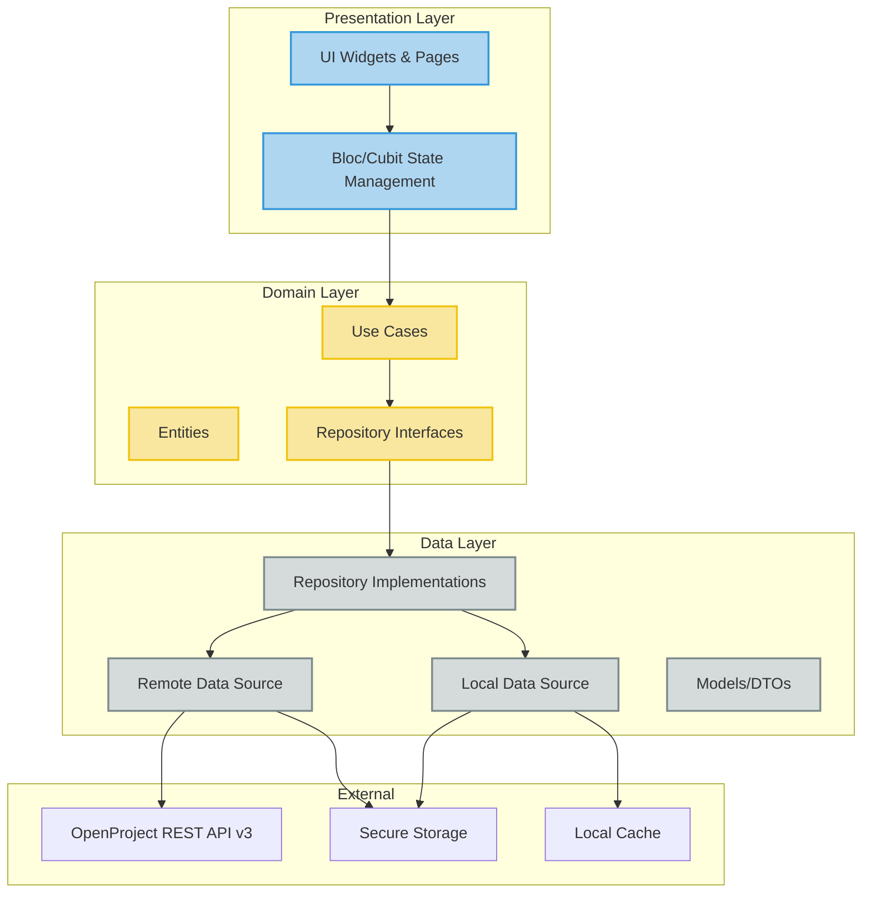
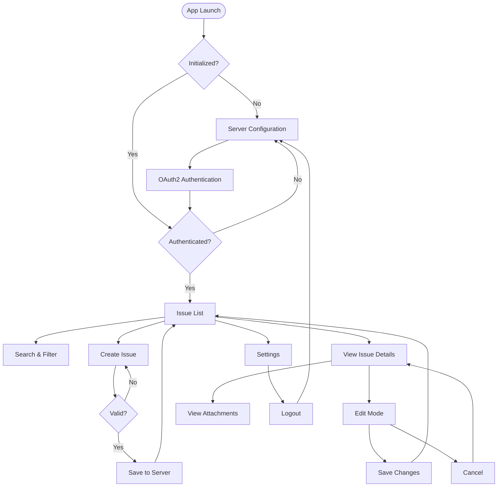
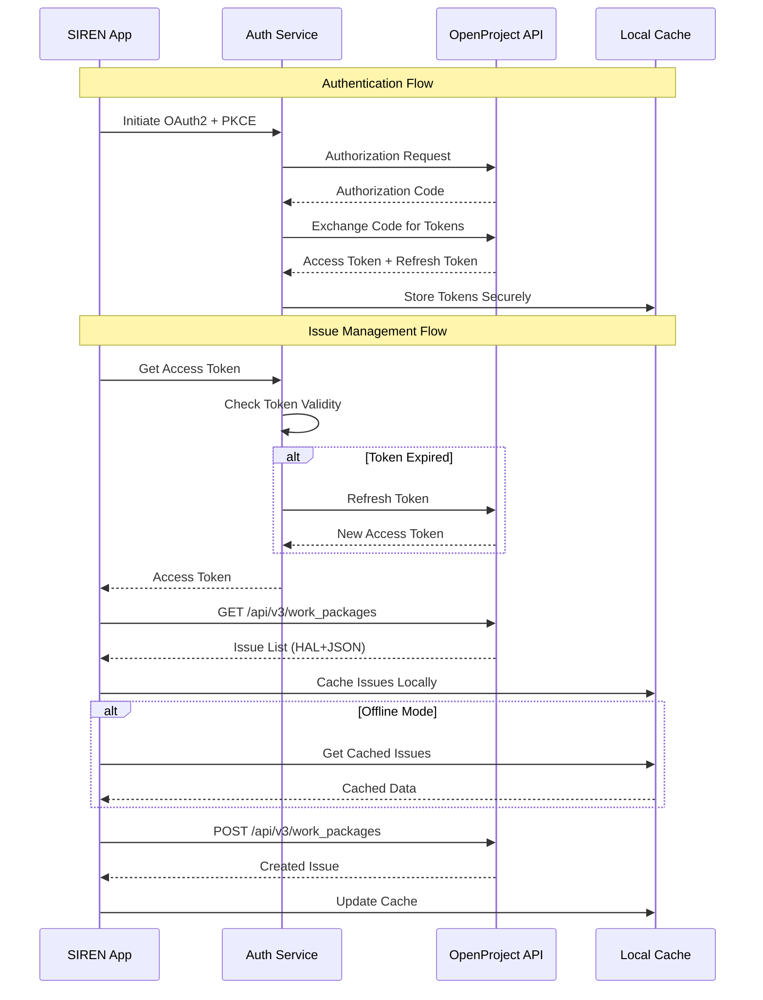
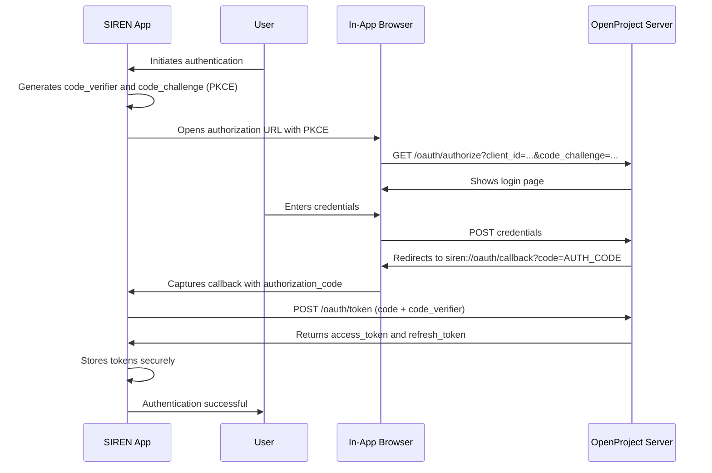

# SIREN

<div align="center">

**System for Issue Reporting and Engineering Notification**

[](https://flutter.dev/)
[](https://dart.dev/)
[](https://www.gnu.org/licenses/gpl-3.0)
[](https://flutter.dev/)
[](https://github.com/danibeni/SIREN_APP)

*A Flutter multiplatform mobile application for unified management of technical issues affecting critical infrastructure at an astronomical observatory.*

</div>

---

## 📱 Screenshots

<div align="center">

### Issue List Screen


*Main interface showing issues with search, filters, and status indicators*

---

### Server Configuration Screen


*Initial setup screen for configuring OpenProject server URL and OAuth2 authentication*

> **Note**: If screenshots don't display, ensure the image files exist in `assets/screenshots/`. See `assets/screenshots/README.md` for instructions.

</div>

---

## ✨ Key Features

### 🔐 Secure Authentication
- **OAuth2 + PKCE** authentication flow for enhanced security
- Automatic token refresh mechanism
- Secure credential storage using `flutter_secure_storage`
- Per-user authentication with granular access control

### 📋 Issue Management
- **Create** new technical issues with essential fields
- **View** complete issue details with attachments
- **Edit** existing issues (title, description, priority, status)
- **Search** and **filter** issues by multiple criteria
- Real-time synchronization with OpenProject server

### 🎯 Smart Filtering & Search
- Multi-criteria filtering (Status, Equipment, Priority, Group)
- Real-time text search in titles and descriptions
- Combined filter logic (AND) for precise results
- Dynamic status loading based on Work Package Type

### 📎 Attachment Support
- Add photos and documents when creating/editing issues
- View existing attachments with file type icons
- Open attachments with system default applications
- Optimized API integration (single request for issue + attachments)

### 🔄 Offline Capability (MVP)
- Local cache for issue list (approximately 3 screenfuls)
- Offline viewing of cached issues and details
- Manual synchronization for offline modifications
- Status cache for offline access

### 🌍 Multi-platform Support
- **iOS** - Native iOS application
- **Android** - Native Android application
- **Web** - Web support for development and testing
- **Desktop** - Windows, macOS, and Linux support

### 🎨 Modern UI/UX
- Material Design 3 components
- Mobile-first, intuitive interface
- Optimized for smartphone screens
- Real-time validation and feedback
- Loading states and error handling

---

## 🏗️ Architecture

SIREN follows **Clean Architecture** principles with strict layer separation, ensuring maintainability, testability, and scalability.

### Architecture Diagram



### Key Principles

- **Domain Layer**: Pure Dart, business logic without Flutter dependencies
- **Dependency Injection**: Modular DI using `get_it` with `injectable` code generation
- **State Management**: Bloc/Cubit pattern with `flutter_bloc`
- **Separation of Concerns**: Clear boundaries between features and core services
- **SOLID Principles**: Strict adherence to SOLID principles throughout

### Project Structure

```
/lib
├── /core                    # Core infrastructure
│   ├── /auth                # Authentication services
│   ├── /config              # Configuration management
│   ├── /di                  # Dependency injection
│   ├── /error               # Error handling & failures
│   ├── /i18n                # Internationalization
│   ├── /network             # Network configuration
│   └── /theme               # App theming
│
├── /features                # Feature modules
│   ├── /config              # Configuration feature
│   │   └── /presentation
│   │       ├── /pages       # Settings, Server Config
│   │       └── /cubit       # State management
│   │
│   └── /issues              # Issue management feature
│       ├── /data            # Data layer
│       │   ├── /datasources # Remote & Local data sources
│       │   ├── /models      # DTOs and models
│       │   └── /repositories # Repository implementations
│       │
│       ├── /domain          # Domain layer (Pure Dart)
│       │   ├── /entities    # Business entities
│       │   ├── /repositories # Repository interfaces
│       │   └── /usecases    # Business use cases
│       │
│       └── /presentation    # Presentation layer
│           ├── /pages       # UI pages
│           ├── /widgets     # Reusable widgets
│           └── /bloc        # State management
│
└── main.dart                # Application entry point
```

---

## 🔄 Application Flow

### User Flow Diagram



### OpenProject Integration Flow



---

## 🛠️ Technology Stack

| Category | Technology | Purpose |
|----------|-----------|---------|
| **Framework** | Flutter 3.0+ | Cross-platform UI framework |
| **Language** | Dart 3.0+ | Programming language |
| **State Management** | flutter_bloc | Predictable state management |
| **Dependency Injection** | get_it + injectable | Modular DI with code generation |
| **HTTP Client** | dio | REST API communication |
| **Secure Storage** | flutter_secure_storage | Secure credential storage |
| **Localization** | flutter_localizations | Multi-language support |
| **Testing** | flutter_test, mockito | Unit and widget testing |
| **Code Generation** | build_runner | DI and serialization code generation |

---

## 📦 Installation

### Prerequisites

1. **Flutter SDK**: Latest stable version
   - Follow the [official installation guide](https://docs.flutter.dev/get-started/install)
   - Verify installation:
     ```bash
     flutter doctor
     ```

2. **Dart**: Version 3.0 or higher

3. **OpenProject Server**: Local or remote OpenProject instance configured and accessible

### Installation Steps

1. **Clone the repository:**
   ```bash
   git clone https://github.com/danibeni/SIREN_APP.git
   cd SIREN_APP
   ```

2. **Install dependencies:**
   ```bash
   flutter pub get
   ```

3. **Run code generation** (if needed):
   ```bash
   flutter pub run build_runner build --delete-conflicting-outputs
   ```

4. **Run the application:**
   ```bash
   # Run on default device
   flutter run

   # Run on specific device
   flutter run -d <device_id>

   # List available devices
   flutter devices
   ```

### Network Configuration for Testing

**⚠️ Important: Network Configuration for Emulators**

When testing with an Android emulator, you cannot use `http://localhost:9999` because `localhost` in the emulator refers to the emulator itself, not the host machine.

**Options:**

1. **Android Emulator (Recommended)**: Use `http://10.0.2.2:9999`
   - `10.0.2.2` is a special IP address that the Android emulator provides to access the host machine's `localhost`

2. **Physical Device**: Use your computer's local IP address (e.g., `http://192.168.1.100:9999`)
   - Find your IP: `ipconfig` (Windows) or `ifconfig` (Linux/Mac)
   - Ensure your device and computer are on the same network
   - Ensure OpenProject accepts connections from your network (not just localhost)

3. **iOS Simulator**: Can use `http://localhost:9999` directly (no special IP needed)

---

## 🔐 Authentication System: OAuth2 + PKCE

SIREN uses **OAuth2 with PKCE** (Proof Key for Code Exchange) to authenticate with OpenProject. This system is superior to a simple API Key for the following reasons:

### Why OAuth2 + PKCE?

1. **Enhanced Security**:
   - **No secret storage**: Mobile applications cannot securely store a `client_secret`. PKCE eliminates this need.
   - **Protection against interception**: PKCE ensures that the application that initiates the login is the same one that receives the `access_token`, preventing authorization code interception attacks.
   - **Tokens with expiration**: Access tokens have a limited lifetime and are automatically renewed.

2. **User Management**:
   - **Per-user authentication**: Each user authenticates with their own OpenProject credentials.
   - **Granular access control**: Access is based on the user's permissions in OpenProject.
   - **Easy revocation**: Tokens can be revoked without affecting other users.

3. **Standards Compliance**:
   - **OAuth2 is a standard**: Widely adopted and well-documented.
   - **PKCE is recommended for public clients**: Specifically designed for mobile applications.

4. **Flexibility**:
   - **Automatic renewal**: Tokens are automatically renewed without user intervention.
   - **Secure sessions**: Sessions are managed securely with access and refresh tokens.

### OAuth2 + PKCE Authentication Flow



### Detailed Flow Steps

#### Step 1: PKCE Generation

The application generates:
- `code_verifier`: Random string of 43-128 characters (URL-safe)
- `code_challenge`: `BASE64URL(SHA256(code_verifier))`
- `code_challenge_method`: `S256`

#### Step 2: Authorization Request

The application builds the authorization URL:

```
https://your-openproject.com/oauth/authorize?
  response_type=code&
  client_id=CLIENT_ID&
  redirect_uri=siren://oauth/callback&
  code_challenge=CODE_CHALLENGE&
  code_challenge_method=S256&
  scope=api_v3
```

#### Step 3: Code Exchange for Tokens

After the user authorizes, OpenProject redirects to `siren://oauth/callback?code=AUTH_CODE`. The application exchanges the code for tokens:

```
POST https://your-openproject.com/oauth/token
Content-Type: application/x-www-form-urlencoded

grant_type=authorization_code
client_id=CLIENT_ID
code=AUTH_CODE
redirect_uri=siren://oauth/callback
code_verifier=CODE_VERIFIER
```

#### Step 4: Secure Storage

Tokens are stored securely using `flutter_secure_storage`:
- `access_token`: To authenticate API requests
- `refresh_token`: To renew the access_token when it expires

### OpenProject Server Configuration

To configure OpenProject to work with SIREN:

1. **Log in to OpenProject** with an administrator account.

2. Navigate to **Administration** → **API and webhooks** → **OAuth applications**.

3. Click the **+ New application** button.

4. Fill in the application details:
   - **Name**: `SIREN Mobile App` (or another descriptive name)
   - **Redirect URI**: **CRITICAL** - Must be entered exactly:
     ```
     siren://oauth/callback
     ```
     This is a "deep link" that redirects the user back to the SIREN application after authorizing the login on the OpenProject web page.
   - **Confidential**: **No**. This must be set to "No" because a mobile app is a public client.
   - **Scopes**: Set the scope to `api_v3`. This grants the application the necessary permissions to manage work packages (issues) via the REST API.

5. Click **Save**.

6. The next screen will display the **Client ID** and **Client Secret**. The SIREN application only needs the **Client ID**. Make a note of it for the app configuration.

After completing these steps, your OpenProject server is ready to handle authentication requests from the SIREN mobile application.

---

## 📱 Available Screens

### 1. Initialization Screen (`AppInitializationPage`)

**Purpose**: Verifies initial configuration and authentication status.

**Functionality**:
- Checks if the server is configured
- Checks if OAuth2 tokens are stored (access_token and refresh_token)
- Redirects to configuration screen if not configured
- Redirects to main flow if authenticated
- Attempts to automatically renew tokens if expired

### 2. Server Configuration Screen (`ServerConfigPage`)

**Purpose**: Initial configuration of OpenProject server and OAuth2 authentication.

**Functionality**:
- **Server URL Field**: Allows entering the base URL of the OpenProject server (e.g., `https://openproject.example.com` or `http://localhost:9999`)
  - Real-time URL format validation
  - Visual state indicators (success/error)
  - Optimized for mobile devices with appropriate keyboard types
- **Client ID Field**: Allows entering the Client ID obtained from OpenProject OAuth2 configuration
- **"Authenticate" Button**: Initiates OAuth2 flow after URL validation
  - Verifies server accessibility before opening browser (5-second timeout)
  - Opens secure in-app browser (Chrome Custom Tabs on Android, Safari View Controller on iOS)
  - Shows progress indicators during the flow
  - Handles errors with clear messages and suggestions
- **Error Handling**: Actionable error messages with suggestions (verify URL, server accessibility, Client ID validity)

### 3. Settings Screen (`SettingsPage`)

**Purpose**: Application configuration management and user preferences.

**Functionality**:
- **Modify Server URL**: Allows changing the OpenProject server URL
  - Same validation and OAuth2 flow as initial configuration
- **Re-authentication**: Option to re-authenticate via OAuth2
- **Work Package Type Selection**: Allows selecting the Work Package type to display (default: "Issue")
  - When changing the type, statuses (statuses) associated with that type are invalidated and reloaded
  - The issue list automatically updates to show only work packages of the selected type
  - Statuses are loaded dynamically from OpenProject and stored in local cache
- **Logout**: Button to log out that:
  - Deletes all stored OAuth2 tokens (access_token and refresh_token)
  - Preserves server URL configuration
  - Redirects to authentication screen to allow a different user to authenticate

### 4. Issue List Screen (`IssueListPage`)

**Purpose**: Visualization and management of the issue list.

**Functionality**:
- **Issue List**: Displays all issues accessible to the authenticated user
  - Only shows work packages of the type configured in Settings (default: "Issue")
  - Automatic filtering by authorized groups/departments (controlled by OpenProject API)
  - Each card shows: title, status, priority (with color circle), equipment/project
- **Pull to Refresh**: Update the list by swiping down
  - Updates the issue list
  - Updates status cache for the configured Work Package type
- **Text Search**: Search field that allows searching in title (Subject) and description
  - Real-time search
  - Case-insensitive search with partial word matching
  - Combined with other filters using AND logic
- **Filters**: Modal or sidebar with filtering options:
  - **Status**: Multiple status selection
  - **Equipment/Project**: Specific equipment selection
  - **Priority**: Multiple priority level selection
  - **Group**: Single group selection
  - All filters are combined with AND logic
  - Work Package Type filter is always applied (cannot be overridden)
- **Synchronization Indicators**: For issues with pending offline modifications:
  - Sync button (circular icon with cloud/sync)
  - Cancel button (circular icon with cancel/close)
  - Both buttons only visible for issues with pending modifications
- **Navigation**: Tapping an issue card navigates to the detail screen
- **Empty State**: Friendly message when no issues are available
- **Offline Support**: Shows cached list when offline (limited to approximately 3 screens)

### 5. Issue Creation Screen (`IssueFormPage`)

**Purpose**: Create new technical issues.

**Functionality**:
- **Form Fields**:
  - **Title (Subject)**: Required text field
  - **Description**: Optional multi-line text field
  - **Group**: Required group selector
    - Shows only groups accessible to the authenticated user
    - If the user belongs to only one group, it is automatically selected
  - **Equipment**: Required equipment selector
    - Dynamically filtered based on selected group
    - Only shows projects (equipment) available for the selected group
  - **Priority (Priority Level)**: Required priority selector
    - Segmented buttons with color indicators:
      - Low: Light blue
      - Normal: Blue
      - High: Orange
      - Immediate: Purple
- **Validation**: Clear error messages if mandatory fields are missing
  - Preserves user input when validation fails
- **Submission**: On successful save, navigates back to the issue list
- **Feedback**: Loading indicators and success/error messages

### 6. Issue Detail Screen (`IssueDetailPage`)

**Purpose**: View and edit complete details of an issue.

**Functionality**:

#### Read-Only Mode (default):
- **Complete Information**: Displays all issue details:
  - Title (Subject)
  - Description (scrollable)
  - Status (with color from OpenProject API)
  - Priority (with color from OpenProject API)
  - Equipment/Project (read-only, cannot be changed)
  - Creator and timestamps
  - Attachments (list with file type icons)
- **Attachment Visualization**: List of existing attachments
  - Icons by file type (PDF, JPG, PNG, DOC, etc.)
  - Truncated filename
  - Tapping an attachment opens it with the system default application
- **Edit Button (FAB)**: Floating action button with edit icon to enter edit mode

#### Edit Mode:
- **Editable Fields**:
  - **Title (Subject)**: Editable text field
  - **Description**: Editable multi-line text field
  - **Priority (Priority Level)**: Editable selector with dynamic colors from API
  - **Status**: Editable selector with statuses dynamically loaded for the configured Work Package type
    - Colors obtained from OpenProject API
- **Read-Only Fields**:
  - **Equipment**: Disabled field with visual indicator
    - Cannot be changed because it is linked to the OpenProject project
    - Changing it would require moving the issue to a different project (must be done via web)
- **Attachment Management**:
  - Visualization of existing attachments (read-only, cannot be deleted from mobile app)
  - "Add Attachment" button to add new attachments (camera/gallery)
  - Attachments can only be added, not deleted (deletion must be done via OpenProject web interface)
- **Action Buttons**:
  - **Save**: Validates and saves changes
    - If online: Saves immediately to server
    - If offline: Saves locally and marks for synchronization
  - **Cancel**: Discards changes and returns to read-only mode
- **Navigation Confirmation**: If the user attempts to navigate back with unsaved changes, a confirmation dialog is shown
- **Optimistic Locking**: Uses `lockVersion` to prevent concurrent modification conflicts

---

## 🔌 API Integration

### OpenProject REST API v3

- **Base URL**: Configured server URL + `/api/v3`
- **Authentication**: OAuth2 Bearer Token (obtained via OAuth2 + PKCE flow)
- **Content Format**: `application/hal+json` (HATEOAS)
- **Content-Type**: `application/json` for request bodies

### Key Endpoints

| Method | Endpoint | Purpose |
|--------|----------|---------|
| `GET` | `/api/v3/work_packages` | List issues with filters and pagination |
| `GET` | `/api/v3/work_packages/{id}` | Get single issue |
| `POST` | `/api/v3/work_packages` | Create new issue |
| `PATCH` | `/api/v3/work_packages/{id}` | Update issue |
| `POST` | `/api/v3/work_packages/{id}/attachments` | Add attachments |
| `GET` | `/api/v3/statuses` | Get available statuses |
| `GET` | `/api/v3/priorities` | Get priority levels |
| `GET` | `/api/v3/projects` | Get projects (equipment) |
| `GET` | `/api/v3/groups` | Get user groups |

### HATEOAS Discovery

OpenProject API uses HATEOAS. The app discovers available actions and resources dynamically via `_links` in API responses.

### Issue Fields

| Field | Required | Description |
|-------|----------|-------------|
| Title (Subject) | Yes | Free text issue title |
| Description | No | Optional detailed description |
| Equipment | Yes | OpenProject project (filtered by selected group) |
| Group/Department | Yes | Single group selection (auto-selected if user belongs to one group) |
| Priority Level | Yes | Low, Normal, High, Immediate |
| Status | No | New, In Progress, Closed (auto-set to "New" on creation) |

---

## 🌍 Multi-language Support

SIREN is prepared for multi-language support with a complete i18n structure:

### Supported Languages

- **Spanish** (es): Primary language
- **English** (en): Secondary language

### Internationalization Structure

The application uses ARB (Application Resource Bundle) files for localization:

```
/lib/core/i18n/
├── l10n/
│   ├── app_es.arb    # Spanish resources
│   └── app_en.arb    # English resources
├── localization_service.dart
└── localization_repository.dart
```

### Language Change

Language change is managed through the localization service, allowing users to select their preferred language. The configuration is persisted and applied throughout the application.

**Note**: Complete multi-language implementation is in development (Post-MVP). The structure is prepared and ARB files are available for translating all interface strings.

---

## 🧪 Development

### Running Tests

```bash
# Run all tests
flutter test

# Run with coverage
flutter test --coverage

# Run specific test file
flutter test test/features/issues/domain/usecases/create_issue_uc_test.dart
```

### Code Quality

```bash
# Analyze code
flutter analyze

# Format code
flutter format .
```

### Feature Development Workflow

1. **Domain Layer**: Define entity → Repository interface → Use cases
2. **Data Layer**: Create model (DTO) → Implement data source → Implement repository
3. **Presentation Layer**: Create Bloc/Cubit → Build UI widgets → Connect to use cases
4. **DI Registration**: Create feature module and register dependencies

---

## 📊 Project Status

### Completed Features (MVP)

✅ **Phase 1: Setup / Foundational**
- Clean Architecture structure
- Dependency Injection system
- Error handling infrastructure
- OAuth2 + PKCE authentication

✅ **Phase 2: Configuration and Testing**
- Server URL configuration
- OAuth2 authentication flow
- Settings screen with logout
- Testing infrastructure

✅ **Phase 3: Quick Issue Registration**
- Issue creation form
- Field validation
- Dynamic group/equipment filtering
- Priority selection

✅ **Phase 4: Issue Management**
- Issue list with filtering
- Issue detail view
- Issue editing
- Attachment support
- Offline cache (MVP)
- Status management

✅ **Phase 5: Search and Filtering**
- Text search
- Multi-criteria filtering
- Real-time search

### In Progress / Planned

🔄 **Phase 6: Architectural Preparation (Post-MVP)**
- Complete i18n implementation
- Offline-first architecture design
- AI integration preparation
- Voice commands architecture

📋 **Phase 7: Offline Issue Management (Post-MVP)**
- Full offline support
- Local database integration
- Conflict resolution
- Automatic synchronization

---

## 🗺️ Future Roadmap

- **Offline Capability**: Full local database integration for offline issue creation and modification
- **Multi-language Support**: Complete Spanish/English localization
- **AI Integration**: Automated categorization and predictive features
- **Voice Commands**: Hands-free issue registration for field technicians
- **Enhanced Analytics**: Issue tracking and reporting features

---

## 🤝 Contributing

1. Follow Clean Architecture principles strictly
2. Write tests for new use cases and critical business logic
3. Run `flutter analyze` before committing
4. Use GitHub CLI (`gh`) for repository operations

---

## 📚 Documentation

- **OpenProject API**: [OpenProject REST API v3 Documentation](https://www.openproject.org/docs/api/)
- **Flutter Framework**: [Flutter Documentation](https://flutter.dev/)
- **Project Documentation**: See `/docs` directory for detailed technical documentation

---

## ✅ Success Criteria

- **Usability**: Users can register a new issue in less than one minute
- **Adoption**: 90% of new technical issues reported via SIREN in first month
- **Business Impact**: Reduced MTTR in critical systems

---

## 📄 License

This project is licensed under the GNU General Public License v3.0 (GPL-3.0).

```
Copyright (C) 2024 Daniel Benitez

This program is free software: you can redistribute it and/or modify
it under the terms of the GNU General Public License as published by
the Free Software Foundation, either version 3 of the License, or
(at your option) any later version.

This program is distributed in the hope that it will be useful,
but WITHOUT ANY WARRANTY; without even the implied warranty of
MERCHANTABILITY or FITNESS FOR A PARTICULAR PURPOSE.  See the
GNU General Public License for more details.

You should have received a copy of the GNU General Public License
along with this program.  If not, see <https://www.gnu.org/licenses/>.
```

---

## 👤 Author

**Daniel Benitez** - danibeni.dev@gmail.com

---

**Note**: This project was developed with AI assistance as part of the AI-Expert course at [Devexpert Academy](https://academia.devexpert.io/course/ai-expert).
