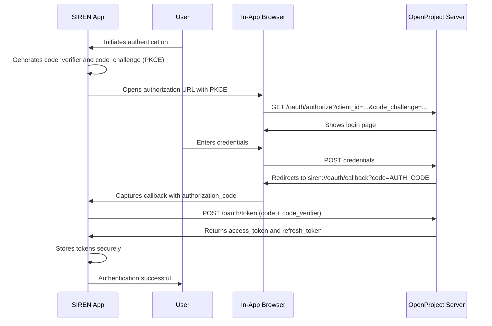

# SIREN

**System for Issue Reporting and Engineering Notification**

SIREN is a Flutter mobile application designed to facilitate access, modification, and registration of technical issues on a local OpenProject server. The application enables field technicians to manage issues directly from their mobile devices, without requiring computer access, simplifying system interaction and limiting required data to the essentials for issue management.

## Description

SIREN is a mobile tool that enables:

- **Access** to existing issues from a local OpenProject server
- **Modify** existing issues (title, description, priority, status)
- **Register** new issues with essential fields:
  - **Title** (Subject): Descriptive title of the issue
  - **Description** (Description): Optional detailed description
  - **Priority** (Priority Level): Priority level (Low, Normal, High, Immediate)
  - **Status**: Current status of the issue (New, In Progress, Closed, etc.)
  - **Equipment**: Infrastructure, equipment, or project to which the issue belongs
  - **Group**: Responsible group or department (if the user belongs to more than one group/department)
- **Attachments**: Add relevant documents for the issue, photos, or images/diagrams

The application is optimized for mobile devices, providing an intuitive and efficient interface that enables quick and easy issue management.

## Installation

### Prerequisites

1. **Flutter SDK**: Latest stable version
   - Follow the [official installation guide](https://docs.flutter.dev/get-started/install)
   - Verify installation:
     ```bash
     flutter doctor
     ```

2. **Dart**: Version 3.0 or higher

3. **OpenProject Server**: Local or remote OpenProject instance configured and accessible

### Installation Steps

1. **Clone the repository:**
   ```bash
   git clone https://github.com/danibeni/SIREN_APP.git
   cd SIREN_APP
   ```

2. **Install dependencies:**
   ```bash
   flutter pub get
   ```

3. **Run code generation** (if needed):
   ```bash
   flutter pub run build_runner build --delete-conflicting-outputs
   ```

4. **Run the application:**
   ```bash
   # Run on default device
   flutter run

   # Run on specific device
   flutter run -d <device_id>

   # List available devices
   flutter devices
   ```

## Multi-platform Support

SIREN is developed with **Flutter**, providing native support for multiple platforms:

- **Android**: Compatible with Android devices (minimum version as per configuration)
- **iOS**: Compatible with iPhone and iPad devices (minimum version as per configuration)
- **Web**: Web support (optional, for development and testing)
- **Desktop**: Support for Windows, macOS, and Linux (optional)

The application uses a single codebase for all platforms, ensuring consistency in user experience and facilitating maintenance.

### Network Configuration for Testing

**⚠️ Important: Network Configuration for Emulators**

When testing with an Android emulator, you cannot use `http://localhost:9999` because `localhost` in the emulator refers to the emulator itself, not the host machine.

**Options:**

1. **Android Emulator (Recommended)**: Use `http://10.0.2.2:9999`
   - `10.0.2.2` is a special IP address that the Android emulator provides to access the host machine's `localhost`

2. **Physical Device**: Use your computer's local IP address (e.g., `http://192.168.1.100:9999`)
   - Find your IP: `ipconfig` (Windows) or `ifconfig` (Linux/Mac)
   - Ensure your device and computer are on the same network
   - Ensure OpenProject accepts connections from your network (not just localhost)

3. **iOS Simulator**: Can use `http://localhost:9999` directly (no special IP needed)

## Authentication System: OAuth2 + PKCE

SIREN uses **OAuth2 with PKCE** (Proof Key for Code Exchange) to authenticate with OpenProject. This system is superior to a simple API Key for the following reasons:

### Why is OAuth2 + PKCE Better than an API Key?

1. **Enhanced Security**:
   - **No secret storage**: Mobile applications cannot securely store a `client_secret`. PKCE eliminates this need.
   - **Protection against interception**: PKCE ensures that the application that initiates the login is the same one that receives the `access_token`, preventing authorization code interception attacks.
   - **Tokens with expiration**: Access tokens have a limited lifetime and are automatically renewed.

2. **User Management**:
   - **Per-user authentication**: Each user authenticates with their own OpenProject credentials.
   - **Granular access control**: Access is based on the user's permissions in OpenProject.
   - **Easy revocation**: Tokens can be revoked without affecting other users.

3. **Standards Compliance**:
   - **OAuth2 is a standard**: Widely adopted and well-documented.
   - **PKCE is recommended for public clients**: Specifically designed for mobile applications.

4. **Flexibility**:
   - **Automatic renewal**: Tokens are automatically renewed without user intervention.
   - **Secure sessions**: Sessions are managed securely with access and refresh tokens.

### OAuth2 + PKCE Authentication Flow

The following diagram illustrates the complete authentication flow:



### Detailed Flow Steps

#### Step 1: PKCE Generation

The application generates:
- `code_verifier`: Random string of 43-128 characters (URL-safe)
- `code_challenge`: `BASE64URL(SHA256(code_verifier))`
- `code_challenge_method`: `S256`

#### Step 2: Authorization Request

The application builds the authorization URL:

```
https://your-openproject.com/oauth/authorize?
  response_type=code&
  client_id=CLIENT_ID&
  redirect_uri=siren://oauth/callback&
  code_challenge=CODE_CHALLENGE&
  code_challenge_method=S256&
  scope=api_v3
```

#### Step 3: Code Exchange for Tokens

After the user authorizes, OpenProject redirects to `siren://oauth/callback?code=AUTH_CODE`. The application exchanges the code for tokens:

```
POST https://your-openproject.com/oauth/token
Content-Type: application/x-www-form-urlencoded

grant_type=authorization_code
client_id=CLIENT_ID
code=AUTH_CODE
redirect_uri=siren://oauth/callback
code_verifier=CODE_VERIFIER
```

#### Step 4: Secure Storage

Tokens are stored securely using `flutter_secure_storage`:
- `access_token`: To authenticate API requests
- `refresh_token`: To renew the access_token when it expires

### OpenProject Server Configuration

To configure OpenProject to work with SIREN:

1. **Log in to OpenProject** with an administrator account.

2. Navigate to **Administration** → **API and webhooks** → **OAuth applications**.

3. Click the **+ New application** button.

4. Fill in the application details:
   - **Name**: `SIREN Mobile App` (or another descriptive name)
   - **Redirect URI**: **CRITICAL** - Must be entered exactly:
     ```
     siren://oauth/callback
     ```
     This is a "deep link" that redirects the user back to the SIREN application after authorizing the login on the OpenProject web page.
   - **Confidential**: **No**. This must be set to "No" because a mobile app is a public client.
   - **Scopes**: Set the scope to `api_v3`. This grants the application the necessary permissions to manage work packages (issues) via the REST API.

5. Click **Save**.

6. The next screen will display the **Client ID** and **Client Secret**. The SIREN application only needs the **Client ID**. Make a note of it for the app configuration.

After completing these steps, your OpenProject server is ready to handle authentication requests from the SIREN mobile application.

## Multi-language Support

SIREN is prepared for multi-language support with a complete i18n structure:

### Supported Languages

- **Spanish** (es): Primary language
- **English** (en): Secondary language

### Internationalization Structure

The application uses ARB (Application Resource Bundle) files for localization:

```
/lib/core/i18n/
├── l10n/
│   ├── app_es.arb    # Spanish resources
│   └── app_en.arb    # English resources
├── localization_service.dart
└── localization_repository.dart
```

### Language Change

Language change is managed through the localization service, allowing users to select their preferred language. The configuration is persisted and applied throughout the application.

**Note**: Complete multi-language implementation is in development (Post-MVP). The structure is prepared and ARB files are available for translating all interface strings.

## Available Screens

SIREN includes the following main screens:

### 1. Initialization Screen (`AppInitializationPage`)

**Purpose**: Verifies initial configuration and authentication status.

**Functionality**:
- Checks if the server is configured
- Checks if OAuth2 tokens are stored (access_token and refresh_token)
- Redirects to configuration screen if not configured
- Redirects to main flow if authenticated
- Attempts to automatically renew tokens if expired

### 2. Server Configuration Screen (`ServerConfigPage`)

**Purpose**: Initial configuration of OpenProject server and OAuth2 authentication.

**Functionality**:
- **Server URL Field**: Allows entering the base URL of the OpenProject server (e.g., `https://openproject.example.com` or `http://localhost:9999`)
  - Real-time URL format validation
  - Visual state indicators (success/error)
  - Optimized for mobile devices with appropriate keyboard types
- **Client ID Field**: Allows entering the Client ID obtained from OpenProject OAuth2 configuration
- **"Authenticate" Button**: Initiates OAuth2 flow after URL validation
  - Verifies server accessibility before opening browser (5-second timeout)
  - Opens secure in-app browser (Chrome Custom Tabs on Android, Safari View Controller on iOS)
  - Shows progress indicators during the flow
  - Handles errors with clear messages and suggestions
- **Error Handling**: Actionable error messages with suggestions (verify URL, server accessibility, Client ID validity)

### 3. Settings Screen (`SettingsPage`)

**Purpose**: Application configuration management and user preferences.

**Functionality**:
- **Modify Server URL**: Allows changing the OpenProject server URL
  - Same validation and OAuth2 flow as initial configuration
- **Re-authentication**: Option to re-authenticate via OAuth2
- **Work Package Type Selection**: Allows selecting the Work Package type to display (default: "Issue")
  - When changing the type, statuses (statuses) associated with that type are invalidated and reloaded
  - The issue list automatically updates to show only work packages of the selected type
  - Statuses are loaded dynamically from OpenProject and stored in local cache
- **Logout**: Button to log out that:
  - Deletes all stored OAuth2 tokens (access_token and refresh_token)
  - Preserves server URL configuration
  - Redirects to authentication screen to allow a different user to authenticate

### 4. Issue List Screen (`IssueListPage`)

**Purpose**: Visualization and management of the issue list.

**Functionality**:
- **Issue List**: Displays all issues accessible to the authenticated user
  - Only shows work packages of the type configured in Settings (default: "Issue")
  - Automatic filtering by authorized groups/departments (controlled by OpenProject API)
  - Each card shows: title, status, priority (with color circle), equipment/project
- **Pull to Refresh**: Update the list by swiping down
  - Updates the issue list
  - Updates status cache for the configured Work Package type
- **Text Search**: Search field that allows searching in title (Subject) and description
  - Real-time search
  - Case-insensitive search with partial word matching
  - Combined with other filters using AND logic
- **Filters**: Modal or sidebar with filtering options:
  - **Status**: Multiple status selection
  - **Equipment/Project**: Specific equipment selection
  - **Priority**: Multiple priority level selection
  - **Group**: Single group selection
  - All filters are combined with AND logic
  - Work Package Type filter is always applied (cannot be overridden)
- **Synchronization Indicators**: For issues with pending offline modifications:
  - Sync button (circular icon with cloud/sync)
  - Cancel button (circular icon with cancel/close)
  - Both buttons only visible for issues with pending modifications
- **Navigation**: Tapping an issue card navigates to the detail screen
- **Empty State**: Friendly message when no issues are available
- **Offline Support**: Shows cached list when offline (limited to approximately 3 screens)

### 5. Issue Creation Screen (`IssueFormPage`)

**Purpose**: Create new technical issues.

**Functionality**:
- **Form Fields**:
  - **Title (Subject)**: Required text field
  - **Description**: Optional multi-line text field
  - **Group**: Required group selector
    - Shows only groups accessible to the authenticated user
    - If the user belongs to only one group, it is automatically selected
  - **Equipment**: Required equipment selector
    - Dynamically filtered based on selected group
    - Only shows projects (equipment) available for the selected group
  - **Priority (Priority Level)**: Required priority selector
    - Segmented buttons with color indicators:
      - Low: Light blue
      - Normal: Blue
      - High: Orange
      - Immediate: Purple
- **Validation**: Clear error messages if mandatory fields are missing
  - Preserves user input when validation fails
- **Submission**: On successful save, navigates back to the issue list
- **Feedback**: Loading indicators and success/error messages

### 6. Issue Detail Screen (`IssueDetailPage`)

**Purpose**: View and edit complete details of an issue.

**Functionality**:

#### Read-Only Mode (default):
- **Complete Information**: Displays all issue details:
  - Title (Subject)
  - Description (scrollable)
  - Status (with color from OpenProject API)
  - Priority (with color from OpenProject API)
  - Equipment/Project (read-only, cannot be changed)
  - Creator and timestamps
  - Attachments (list with file type icons)
- **Attachment Visualization**: List of existing attachments
  - Icons by file type (PDF, JPG, PNG, DOC, etc.)
  - Truncated filename
  - Tapping an attachment opens it with the system default application
- **Edit Button (FAB)**: Floating action button with edit icon to enter edit mode

#### Edit Mode:
- **Editable Fields**:
  - **Title (Subject)**: Editable text field
  - **Description**: Editable multi-line text field
  - **Priority (Priority Level)**: Editable selector with dynamic colors from API
  - **Status**: Editable selector with statuses dynamically loaded for the configured Work Package type
    - Colors obtained from OpenProject API
- **Read-Only Fields**:
  - **Equipment**: Disabled field with visual indicator
    - Cannot be changed because it is linked to the OpenProject project
    - Changing it would require moving the issue to a different project (must be done via web)
- **Attachment Management**:
  - Visualization of existing attachments (read-only, cannot be deleted from mobile app)
  - "Add Attachment" button to add new attachments (camera/gallery)
  - Attachments can only be added, not deleted (deletion must be done via OpenProject web interface)
- **Action Buttons**:
  - **Save**: Validates and saves changes
    - If online: Saves immediately to server
    - If offline: Saves locally and marks for synchronization
  - **Cancel**: Discards changes and returns to read-only mode
- **Navigation Confirmation**: If the user attempts to navigate back with unsaved changes, a confirmation dialog is shown
- **Optimistic Locking**: Uses `lockVersion` to prevent concurrent modification conflicts

### 7. Issue Edit Screen (`EditIssuePage`)

**Note**: This screen may be integrated into `IssueDetailPage` in edit mode, depending on the implementation.

## Server Configuration and Work Package Type

### OpenProject Server Configuration

The application allows flexible configuration of the OpenProject server URL:

1. **Initial Configuration**: On first launch, the server URL is requested
2. **Modification**: The URL can be modified from the Settings screen
3. **Secure Storage**: The URL is stored securely using `flutter_secure_storage`
4. **Validation**: URL format is validated before storage (protocol, domain, optional port)

### Work Package Type Selection

OpenProject uses "Work Packages" as a generic term for different types of elements (Issues, Tasks, Milestones, etc.). SIREN allows selecting which Work Package type to display:

#### Type Configuration

1. **Access**: From the Settings screen (`SettingsPage`)
2. **Options**: List of types available in the OpenProject server
3. **Default Value**: "Issue"
4. **Storage**: Stored securely using `flutter_secure_storage`

#### Behavior

- **Automatic Filtering**: All queries to the OpenProject API automatically include a filter by the selected type
- **Status Update**: When changing the type:
  - Statuses (statuses) in cache are invalidated
  - Available statuses for the new type are loaded from OpenProject
  - Statuses are stored in local cache with their associated colors
- **List Update**: The issue list automatically updates to show only work packages of the selected type
- **Dynamic Resolution**: The type name is dynamically resolved to its corresponding ID in OpenProject (no hardcoded IDs are used)

#### Dynamic Statuses

Statuses are loaded dynamically according to the Work Package type:

- **Load by Type**: Each Work Package type can have different available statuses
- **Colors from API**: Status colors are obtained from OpenProject API (`color.hexcode` or `hexCode`)
- **Local Cache**: Statuses are stored in local cache for offline use
- **Update**: Statuses are updated when:
  - The Work Package type is changed
  - The issue list is updated (pull to refresh)

#### Usage Example

1. User selects "Issue" as Work Package type
2. Application loads available statuses for "Issue" from OpenProject
3. List shows only work packages of type "Issue"
4. When creating a new issue, type "Issue" is used
5. When changing to "Task", the list updates to show only "Tasks" and corresponding statuses are loaded

## Architecture

SIREN follows **Clean Architecture** principles with strict layer separation:

```
Presentation Layer (UI/State Management)
    ↓
Domain Layer (Business Logic/Entities/Use Cases)
    ↓
Data Layer (Repositories/Data Sources/Models)
```

### Key Principles

- **Domain Layer**: Pure Dart, business logic without Flutter dependencies
- **Dependency Injection**: Modular DI using `get_it` with feature-based modules
- **State Management**: Bloc/Cubit pattern with `flutter_bloc`
- **Separation of Concerns**: Clear boundaries between features and core services

### Project Structure

```
/lib
├── /core              # Core infrastructure (DI, errors, auth, network, config, i18n)
├── /features          # Feature modules (issues, future features)
│   └── /issues
│       ├── /data      # Data sources, models, repository implementations
│       ├── /domain    # Entities, repository interfaces, use cases
│       └── /presentation  # UI, Bloc/Cubit, pages, widgets
└── main.dart          # Application entry point
```

## Technical Stack

- **Framework**: Flutter / Dart
- **State Management**: Bloc/Cubit (`flutter_bloc`)
- **Dependency Injection**: `get_it` with modular injection modules
- **HTTP Client**: `dio` for API communication
- **Secure Storage**: `flutter_secure_storage` for credentials
- **Testing**: `flutter_test`, `mockito`/`mocktail` for mocking

## API Integration

### OpenProject REST API v3

- **Base URL**: Configured server URL + `/api/v3`
- **Authentication**: OAuth2 Bearer Token (obtained via OAuth2 + PKCE flow)
- **Content Format**: `application/hal+json` (HATEOAS)
- **Content-Type**: `application/json` for request bodies

### Key Endpoints

- `GET /api/v3/work_packages` - List issues with filters and pagination
- `GET /api/v3/work_packages/{id}` - Get single issue
- `POST /api/v3/work_packages` - Create new issue
- `PATCH /api/v3/work_packages/{id}` - Update issue
- `POST /api/v3/work_packages/{id}/attachments` - Add attachments

### HATEOAS Discovery

OpenProject API uses HATEOAS. The app discovers available actions and resources dynamically via `_links` in API responses.

## Issue Fields

| Field             | Required | Description                                    |
|-------------------|----------|------------------------------------------------|
| Title (Subject)   | Yes      | Free text issue title                          |
| Description       | No       | Optional detailed description                  |
| Equipment         | Yes      | OpenProject project (filtered by selected group) |
| Group/Department  | Yes      | Single group selection (auto-selected if user belongs to one group) |
| Priority Level    | Yes      | Low, Normal, High, Immediate                   |
| Status            | No       | New, In Progress, Closed (auto-set to "New" on creation) |

## Development

### Running Tests

```bash
# Run all tests
flutter test

# Run with coverage
flutter test --coverage

# Run specific test file
flutter test test/features/issues/domain/usecases/create_issue_uc_test.dart
```

### Code Quality

```bash
# Analyze code
flutter analyze

# Format code
flutter format .
```

### Feature Development Workflow

1. **Domain Layer**: Define entity → Repository interface → Use cases
2. **Data Layer**: Create model (DTO) → Implement data source → Implement repository
3. **Presentation Layer**: Create Bloc/Cubit → Build UI widgets → Connect to use cases
4. **DI Registration**: Create feature module and register dependencies

## Future Roadmap

- **Offline Capability**: Local database integration for offline issue creation
- **Multi-language Support**: Complete Spanish/English localization
- **AI Integration**: Automated categorization and predictive features
- **Voice Commands**: Hands-free issue registration for field technicians

## Contributing

1. Follow Clean Architecture principles strictly
2. Write tests for new use cases and critical business logic
3. Run `flutter analyze` before committing
4. Use GitHub CLI (`gh`) for repository operations

## Documentation

- **OpenProject API**: [OpenProject REST API v3 Documentation](https://www.openproject.org/docs/api/)
- **Flutter Framework**: [Flutter Documentation](https://flutter.dev/)

## Success Criteria

- **Usability**: Users can register a new issue in less than one minute
- **Adoption**: 90% of new technical issues reported via SIREN in first month
- **Business Impact**: Reduced MTTR in critical systems

## License

This project is licensed under the GNU General Public License v3.0 (GPL-3.0).

```
Copyright (C) 2024 Daniel Benitez

This program is free software: you can redistribute it and/or modify
it under the terms of the GNU General Public License as published by
the Free Software Foundation, either version 3 of the License, or
(at your option) any later version.

This program is distributed in the hope that it will be useful,
but WITHOUT ANY WARRANTY; without even the implied warranty of
MERCHANTABILITY or FITNESS FOR A PARTICULAR PURPOSE.  See the
GNU General Public License for more details.

You should have received a copy of the GNU General Public License
along with this program.  If not, see <https://www.gnu.org/licenses/>.
```

## Author

**Daniel Benitez** - danibeni.dev@gmail.com

---

**Note**: This project was developed with AI assistance as part of the AI-Expert course at [Devexpert Academy](https://academia.devexpert.io/course/ai-expert).
