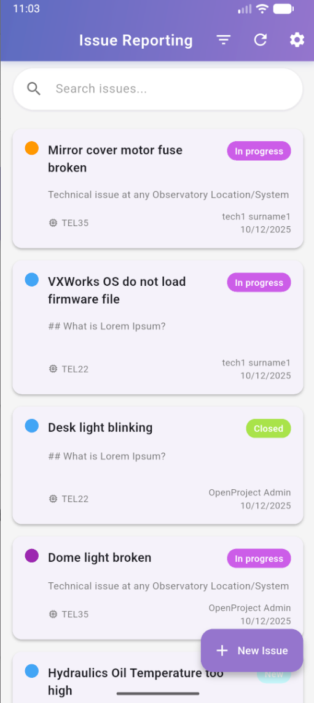
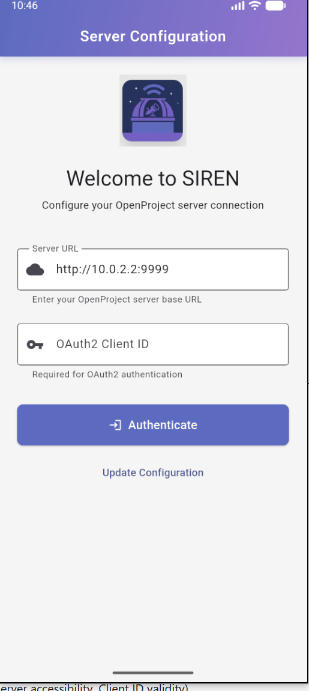
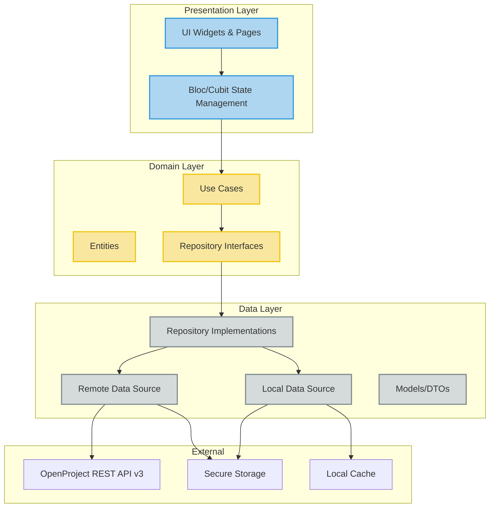
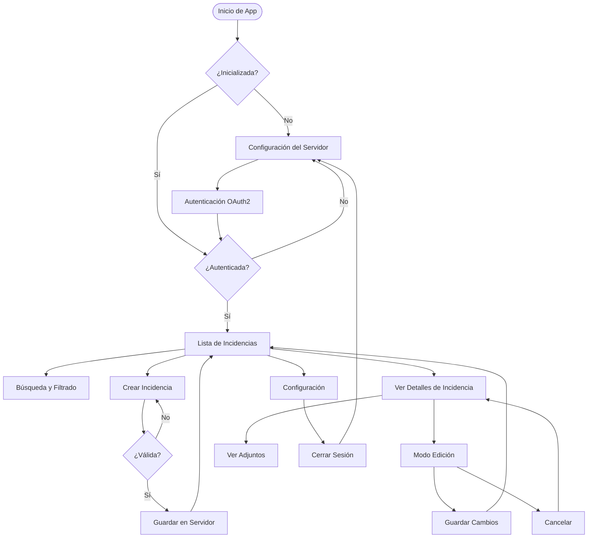
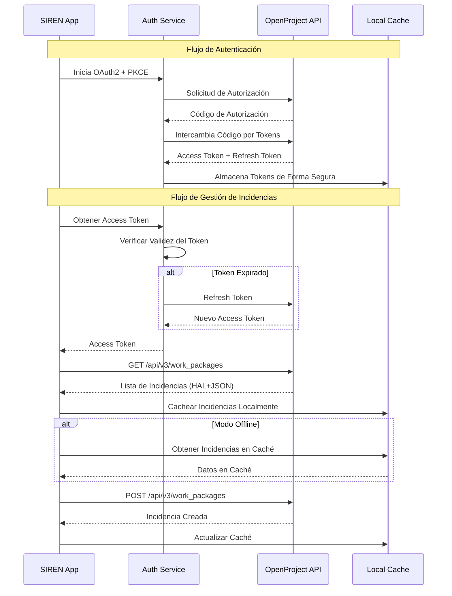
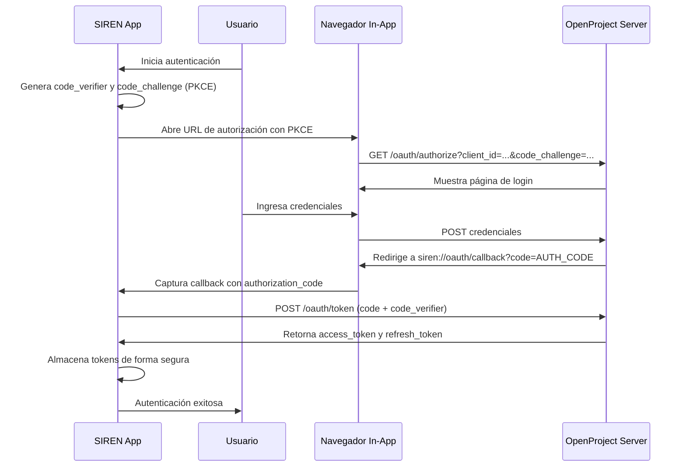

# SIREN

<div align="center">

**System for Issue Reporting and Engineering Notification**

[](https://flutter.dev/)
[](https://dart.dev/)
[](https://www.gnu.org/licenses/gpl-3.0)
[](https://flutter.dev/)
[](https://github.com/danibeni/SIREN_APP)

*Una aplicación móvil Flutter multiplataforma para la gestión unificada de incidencias técnicas que afectan a la infraestructura crítica de un observatorio astronómico.*

</div>

---

## 📱 Capturas de Pantalla

<div align="center">

### Pantalla de Lista de Incidencias



*Interfaz principal mostrando incidencias con búsqueda, filtros e indicadores de estado*

---

### Pantalla de Configuración del Servidor



*Pantalla de configuración inicial para configurar la URL del servidor OpenProject y autenticación OAuth2*

> **Nota**: Si las capturas de pantalla no se muestran, asegúrate de que los archivos de imagen existan en `assets/screenshots/`. Consulta `assets/screenshots/README.md` para instrucciones.

</div>

---

## ✨ Características Principales

### 🔐 Autenticación Segura
- Flujo de autenticación **OAuth2 + PKCE** para mayor seguridad
- Mecanismo de renovación automática de tokens
- Almacenamiento seguro de credenciales usando `flutter_secure_storage`
- Autenticación por usuario con control de acceso granular

### 📋 Gestión de Incidencias
- **Crear** nuevas incidencias técnicas con campos esenciales
- **Ver** detalles completos de incidencias con adjuntos
- **Editar** incidencias existentes (título, descripción, prioridad, estado)
- **Buscar** y **filtrar** incidencias por múltiples criterios
- Sincronización en tiempo real con el servidor OpenProject

### 🎯 Filtrado y Búsqueda Inteligente
- Filtrado multi-criterio (Estado, Equipo, Prioridad, Grupo)
- Búsqueda de texto en tiempo real en títulos y descripciones
- Lógica de filtros combinados (AND) para resultados precisos
- Carga dinámica de estados basada en el Tipo de Work Package

### 📎 Soporte de Adjuntos
- Añadir fotos y documentos al crear/editar incidencias
- Ver adjuntos existentes con iconos de tipo de archivo
- Abrir adjuntos con aplicaciones predeterminadas del sistema
- Integración optimizada con API (una sola petición para incidencia + adjuntos)

### 🔄 Capacidad Offline (MVP)
- Caché local para lista de incidencias (aproximadamente 3 pantallas)
- Visualización offline de incidencias y detalles en caché
- Sincronización manual para modificaciones offline
- Caché de estados para acceso offline

### 🌍 Soporte Multiplataforma
- **iOS** - Aplicación nativa iOS
- **Android** - Aplicación nativa Android
- **Web** - Soporte web para desarrollo y pruebas
- **Desktop** - Soporte para Windows, macOS y Linux

### 🎨 UI/UX Moderna
- Componentes Material Design 3
- Interfaz intuitiva optimizada para móviles
- Optimizada para pantallas de smartphones
- Validación y retroalimentación en tiempo real
- Estados de carga y manejo de errores

---

## 🏗️ Arquitectura

SIREN sigue principios de **Arquitectura Limpia (Clean Architecture)** con separación estricta de capas, garantizando mantenibilidad, testeabilidad y escalabilidad.

### Diagrama de Arquitectura



### Principios Clave

- **Capa de Dominio**: Dart puro, lógica de negocio sin dependencias de Flutter
- **Inyección de Dependencias**: DI modular usando `get_it` con generación de código `injectable`
- **Gestión de Estado**: Patrón Bloc/Cubit con `flutter_bloc`
- **Separación de Responsabilidades**: Límites claros entre características y servicios core
- **Principios SOLID**: Adherencia estricta a principios SOLID en todo el código

### Estructura del Proyecto

```
/lib
├── /core                    # Infraestructura core
│   ├── /auth                # Servicios de autenticación
│   ├── /config              # Gestión de configuración
│   ├── /di                  # Inyección de dependencias
│   ├── /error               # Manejo de errores y fallos
│   ├── /i18n                # Internacionalización
│   ├── /network             # Configuración de red
│   └── /theme               # Temas de la aplicación
│
├── /features                # Módulos de características
│   ├── /config              # Característica de configuración
│   │   └── /presentation
│   │       ├── /pages       # Settings, Server Config
│   │       └── /cubit       # Gestión de estado
│   │
│   └── /issues              # Característica de gestión de incidencias
│       ├── /data            # Capa de datos
│       │   ├── /datasources # Fuentes de datos remotas y locales
│       │   ├── /models      # DTOs y modelos
│       │   └── /repositories # Implementaciones de repositorios
│       │
│       ├── /domain          # Capa de dominio (Pure Dart)
│       │   ├── /entities    # Entidades de negocio
│       │   ├── /repositories # Interfaces de repositorios
│       │   └── /usecases    # Casos de uso de negocio
│       │
│       └── /presentation    # Capa de presentación
│           ├── /pages       # Páginas UI
│           ├── /widgets     # Widgets reutilizables
│           └── /bloc        # Gestión de estado
│
└── main.dart                # Punto de entrada de la aplicación
```

---

## 🔄 Flujo de la Aplicación

### Diagrama de Flujo de Usuario



### Flujo de Integración con OpenProject



---

## 🛠️ Stack Tecnológico

| Categoría | Tecnología | Propósito |
|----------|-----------|---------|
| **Framework** | Flutter 3.0+ | Framework UI multiplataforma |
| **Lenguaje** | Dart 3.0+ | Lenguaje de programación |
| **Gestión de Estado** | flutter_bloc | Gestión de estado predecible |
| **Inyección de Dependencias** | get_it + injectable | DI modular con generación de código |
| **Cliente HTTP** | dio | Comunicación API REST |
| **Almacenamiento Seguro** | flutter_secure_storage | Almacenamiento seguro de credenciales |
| **Localización** | flutter_localizations | Soporte multi-idioma |
| **Testing** | flutter_test, mockito | Testing unitario y de widgets |
| **Generación de Código** | build_runner | Generación de código DI y serialización |

---

## 📦 Instalación

### Requisitos Previos

1. **Flutter SDK**: Versión estable más reciente
   - Sigue la [guía oficial de instalación](https://docs.flutter.dev/get-started/install)
   - Verifica la instalación:
     ```bash
     flutter doctor
     ```

2. **Dart**: Versión 3.0 o superior

3. **Servidor OpenProject**: Instancia local o remota de OpenProject configurada y accesible

### Pasos de Instalación

1. **Clonar el repositorio:**
   ```bash
   git clone https://github.com/danibeni/SIREN_APP.git
   cd SIREN_APP
   ```

2. **Instalar dependencias:**
   ```bash
   flutter pub get
   ```

3. **Ejecutar generación de código** (si es necesario):
   ```bash
   flutter pub run build_runner build --delete-conflicting-outputs
   ```

4. **Ejecutar la aplicación:**
   ```bash
   # Ejecutar en el dispositivo por defecto
   flutter run

   # Ejecutar en un dispositivo específico
   flutter run -d <device_id>

   # Listar dispositivos disponibles
   flutter devices
   ```

### Configuración de Red para Pruebas

**⚠️ Importante: Configuración de Red para Emuladores**

Cuando se prueba con un emulador Android, no se puede usar `http://localhost:9999` porque `localhost` en el emulador se refiere al propio emulador, no a la máquina host.

**Opciones:**

1. **Emulador Android (Recomendado)**: Usar `http://10.0.2.2:9999`
   - `10.0.2.2` es una dirección IP especial que el emulador Android proporciona para acceder a `localhost` de la máquina host

2. **Dispositivo Físico**: Usar la dirección IP local de tu computadora (ej: `http://192.168.1.100:9999`)
   - Encuentra tu IP: `ipconfig` (Windows) o `ifconfig` (Linux/Mac)
   - Asegúrate de que el dispositivo y la computadora estén en la misma red
   - Asegúrate de que OpenProject acepte conexiones desde tu red (no solo localhost)

3. **Simulador iOS**: Puede usar `http://localhost:9999` directamente (no se necesita IP especial)

---

## 🔐 Sistema de Autenticación: OAuth2 + PKCE

SIREN utiliza **OAuth2 con PKCE** (Proof Key for Code Exchange) para autenticarse con OpenProject. Este sistema es superior a una simple API Key por las siguientes razones:

### ¿Por qué OAuth2 + PKCE es mejor que una API Key?

1. **Seguridad Mejorada**:
   - **Sin almacenamiento de secretos**: Las aplicaciones móviles no pueden almacenar de forma segura un `client_secret`. PKCE elimina esta necesidad.
   - **Protección contra interceptación**: PKCE garantiza que la aplicación que inicia el login es la misma que recibe el `access_token`, previniendo ataques de interceptación del código de autorización.
   - **Tokens con expiración**: Los tokens de acceso tienen un tiempo de vida limitado y se renuevan automáticamente.

2. **Gestión de Usuarios**:
   - **Autenticación por usuario**: Cada usuario se autentica con sus propias credenciales de OpenProject.
   - **Control de acceso granular**: El acceso se basa en los permisos del usuario en OpenProject.
   - **Revocación fácil**: Los tokens pueden ser revocados sin afectar a otros usuarios.

3. **Cumplimiento de Estándares**:
   - **OAuth2 es un estándar**: Ampliamente adoptado y bien documentado.
   - **PKCE es recomendado para clientes públicos**: Específicamente diseñado para aplicaciones móviles.

4. **Flexibilidad**:
   - **Renovación automática**: Los tokens se renuevan automáticamente sin intervención del usuario.
   - **Sesiones seguras**: Las sesiones se gestionan de forma segura con tokens de acceso y renovación.

### Flujo de Autenticación OAuth2 + PKCE



### Pasos Detallados del Flujo

#### Paso 1: Generación de PKCE

La aplicación genera:
- `code_verifier`: Cadena aleatoria de 43-128 caracteres (URL-safe)
- `code_challenge`: `BASE64URL(SHA256(code_verifier))`
- `code_challenge_method`: `S256`

#### Paso 2: Solicitud de Autorización

La aplicación construye la URL de autorización:

```
https://tu-openproject.com/oauth/authorize?
  response_type=code&
  client_id=CLIENT_ID&
  redirect_uri=siren://oauth/callback&
  code_challenge=CODE_CHALLENGE&
  code_challenge_method=S256&
  scope=api_v3
```

#### Paso 3: Intercambio de Código por Tokens

Después de que el usuario autoriza, OpenProject redirige a `siren://oauth/callback?code=AUTH_CODE`. La aplicación intercambia el código por tokens:

```
POST https://tu-openproject.com/oauth/token
Content-Type: application/x-www-form-urlencoded

grant_type=authorization_code
client_id=CLIENT_ID
code=AUTH_CODE
redirect_uri=siren://oauth/callback
code_verifier=CODE_VERIFIER
```

#### Paso 4: Almacenamiento Seguro

Los tokens se almacenan de forma segura usando `flutter_secure_storage`:
- `access_token`: Para autenticar peticiones API
- `refresh_token`: Para renovar el access_token cuando expire

### Configuración del Servidor OpenProject

Para configurar OpenProject para trabajar con SIREN:

1. **Iniciar sesión en OpenProject** con una cuenta de administrador.

2. Navegar a **Administración** → **API y webhooks** → **Aplicaciones OAuth**.

3. Hacer clic en el botón **+ Nueva aplicación**.

4. Completar los detalles de la aplicación:
   - **Nombre**: `SIREN Mobile App` (o otro nombre descriptivo)
   - **URI de redirección**: **CRÍTICO** - Debe ingresarse exactamente:
     ```
     siren://oauth/callback
     ```
     Este es un "deep link" que redirige al usuario de vuelta a la aplicación SIREN después de autorizar el login en la página web de OpenProject.
   - **Confidencial**: **No**. Debe establecerse en "No" porque una aplicación móvil es un cliente público.
   - **Alcances**: Establecer el alcance en `api_v3`. Esto otorga a la aplicación los permisos necesarios para gestionar work packages (incidencias) a través de la API REST.

5. Hacer clic en **Guardar**.

6. La siguiente pantalla mostrará el **Client ID** y **Client Secret**. La aplicación SIREN solo necesita el **Client ID**. Anótalo para la configuración de la app.

Después de completar estos pasos, tu servidor OpenProject está listo para manejar solicitudes de autenticación desde la aplicación móvil SIREN.

---

## 📱 Pantallas Disponibles

### 1. Pantalla de Inicialización (`AppInitializationPage`)

**Propósito**: Verifica la configuración inicial y el estado de autenticación.

**Funcionalidad**:
- Verifica si el servidor está configurado
- Verifica si hay tokens de OAuth2 almacenados (access_token y refresh_token)
- Redirige a la pantalla de configuración si no está configurado
- Redirige al flujo principal si está autenticado
- Intenta renovar tokens automáticamente si están expirados

### 2. Pantalla de Configuración del Servidor (`ServerConfigPage`)

**Propósito**: Configuración inicial del servidor OpenProject y autenticación OAuth2.

**Funcionalidad**:
- **Campo de URL del Servidor**: Permite ingresar la URL base del servidor OpenProject (ej: `https://openproject.example.com` o `http://localhost:9999`)
  - Validación en tiempo real del formato de URL
  - Indicadores visuales de estado (éxito/error)
  - Optimizado para dispositivos móviles con tipos de teclado apropiados
- **Campo de Client ID**: Permite ingresar el Client ID obtenido de la configuración OAuth2 de OpenProject
- **Botón "Autenticar"**: Inicia el flujo OAuth2 después de validar la URL
  - Verifica la accesibilidad del servidor antes de abrir el navegador (timeout de 5 segundos)
  - Abre navegador in-app seguro (Chrome Custom Tabs en Android, Safari View Controller en iOS)
  - Muestra indicadores de progreso durante el flujo
  - Maneja errores con mensajes claros y sugerencias
- **Manejo de Errores**: Mensajes de error accionables con sugerencias (verificar URL, accesibilidad del servidor, validez del Client ID)

### 3. Pantalla de Configuración (`SettingsPage`)

**Propósito**: Gestión de configuración de la aplicación y preferencias del usuario.

**Funcionalidad**:
- **Modificar URL del Servidor**: Permite cambiar la URL del servidor OpenProject
  - Misma validación y flujo OAuth2 que la configuración inicial
- **Re-autenticación**: Opción para re-autenticarse vía OAuth2
- **Selección de Tipo de Work Package**: Permite seleccionar el tipo de Work Package a mostrar (por defecto: "Issue")
  - Al cambiar el tipo, se invalidan y recargan los estados (statuses) asociados a ese tipo
  - La lista de incidencias se actualiza automáticamente para mostrar solo work packages del tipo seleccionado
  - Los estados se cargan dinámicamente desde OpenProject y se almacenan en caché local
- **Cerrar Sesión**: Botón para cerrar sesión que:
  - Elimina todos los tokens OAuth2 almacenados (access_token y refresh_token)
  - Preserva la configuración del servidor URL
  - Redirige a la pantalla de autenticación para permitir que un usuario diferente se autentique

### 4. Pantalla de Lista de Incidencias (`IssueListPage`)

**Propósito**: Visualización y gestión de la lista de incidencias.

**Funcionalidad**:
- **Lista de Incidencias**: Muestra todas las incidencias accesibles al usuario autenticado
  - Solo muestra work packages del tipo configurado en Settings (por defecto: "Issue")
  - Filtrado automático por grupos/departamentos autorizados (controlado por OpenProject API)
  - Cada tarjeta muestra: título, estado, prioridad (con círculo de color), equipo/proyecto
- **Pull to Refresh**: Actualizar la lista deslizando hacia abajo
  - Actualiza la lista de incidencias
  - Actualiza la caché de estados para el tipo de Work Package configurado
- **Búsqueda de Texto**: Campo de búsqueda que permite buscar en el título (Subject) y descripción
  - Búsqueda en tiempo real
  - Búsqueda case-insensitive con coincidencia parcial de palabras
  - Se combina con otros filtros usando lógica AND
- **Filtros**: Modal o sidebar con opciones de filtrado:
  - **Estado**: Selección múltiple de estados
  - **Equipo/Proyecto**: Selección de equipo específico
  - **Prioridad**: Selección múltiple de niveles de prioridad
  - **Grupo**: Selección única de grupo
  - Todos los filtros se combinan con lógica AND
  - El filtro de Tipo de Work Package siempre está aplicado (no se puede sobrescribir)
- **Indicadores de Sincronización**: Para incidencias con modificaciones offline pendientes:
  - Botón de sincronización (icono circular con nube/sincronización)
  - Botón de cancelar (icono circular con cancelar/cerrar)
  - Ambos botones solo visibles para incidencias con modificaciones pendientes
- **Navegación**: Tocar una tarjeta de incidencia navega a la pantalla de detalles
- **Estado Vacío**: Mensaje amigable cuando no hay incidencias disponibles
- **Soporte Offline**: Muestra la lista en caché cuando está offline (limitada a aproximadamente 3 pantallas)

### 5. Pantalla de Creación de Incidencia (`IssueFormPage`)

**Propósito**: Crear nuevas incidencias técnicas.

**Funcionalidad**:
- **Campos del Formulario**:
  - **Título (Subject)**: Campo de texto requerido
  - **Descripción (Description)**: Campo de texto multilínea opcional
  - **Grupo (Group)**: Selector de grupo requerido
    - Muestra solo grupos accesibles al usuario autenticado
    - Si el usuario pertenece a un solo grupo, se selecciona automáticamente
  - **Equipo (Equipment)**: Selector de equipo requerido
    - Se filtra dinámicamente según el grupo seleccionado
    - Solo muestra proyectos (equipos) disponibles para el grupo seleccionado
  - **Prioridad (Priority Level)**: Selector de prioridad requerido
    - Botones segmentados con indicadores de color:
      - Baja: Azul claro
      - Normal: Azul
      - Alta: Naranja
      - Inmediata: Púrpura
- **Validación**: Mensajes de error claros si faltan campos obligatorios
  - Preserva la entrada del usuario cuando falla la validación
- **Envío**: Al guardar exitosamente, navega de vuelta a la lista de incidencias
- **Feedback**: Indicadores de carga y mensajes de éxito/error

### 6. Pantalla de Detalles de Incidencia (`IssueDetailPage`)

**Propósito**: Visualizar y editar detalles completos de una incidencia.

**Funcionalidad**:

#### Modo Solo Lectura (por defecto):
- **Información Completa**: Muestra todos los detalles de la incidencia:
  - Título (Subject)
  - Descripción (scrollable)
  - Estado (con color desde OpenProject API)
  - Prioridad (con color desde OpenProject API)
  - Equipo/Proyecto (solo lectura, no se puede cambiar)
  - Creador y timestamps
  - Adjuntos (lista con iconos de tipo de archivo)
- **Visualización de Adjuntos**: Lista de adjuntos existentes
  - Iconos según tipo de archivo (PDF, JPG, PNG, DOC, etc.)
  - Nombre de archivo truncado
  - Tocar un adjunto lo abre con la aplicación predeterminada del sistema
- **Botón de Edición (FAB)**: Botón flotante con icono de edición para entrar en modo de edición

#### Modo de Edición:
- **Campos Editables**:
  - **Título (Subject)**: Campo de texto editable
  - **Descripción (Description)**: Campo de texto multilínea editable
  - **Prioridad (Priority Level)**: Selector editable con colores dinámicos desde API
  - **Estado (Status)**: Selector editable con estados cargados dinámicamente para el tipo de Work Package configurado
    - Colores obtenidos desde OpenProject API
- **Campos de Solo Lectura**:
  - **Equipo (Equipment)**: Campo deshabilitado con indicador visual
    - No se puede cambiar porque está vinculado al proyecto de OpenProject
    - El cambio requeriría mover la incidencia a un proyecto diferente (debe hacerse vía web)
- **Gestión de Adjuntos**:
  - Visualización de adjuntos existentes (solo lectura, no se pueden eliminar desde la app móvil)
  - Botón "Añadir Adjunto" para agregar nuevos adjuntos (cámara/galería)
  - Los adjuntos solo se pueden añadir, no eliminar (la eliminación debe hacerse vía interfaz web de OpenProject)
- **Botones de Acción**:
  - **Guardar**: Valida y guarda los cambios
    - Si está online: Guarda inmediatamente en el servidor
    - Si está offline: Guarda localmente y marca para sincronización
  - **Cancelar**: Descarta cambios y vuelve al modo solo lectura
- **Confirmación de Navegación**: Si el usuario intenta navegar hacia atrás con cambios sin guardar, se muestra un diálogo de confirmación
- **Optimistic Locking**: Utiliza `lockVersion` para prevenir conflictos de modificación concurrente

---

## 🔌 Integración con API

### OpenProject REST API v3

- **URL Base**: URL del servidor configurada + `/api/v3`
- **Autenticación**: OAuth2 Bearer Token (obtenido vía flujo OAuth2 + PKCE)
- **Formato de Contenido**: `application/hal+json` (HATEOAS)
- **Content-Type**: `application/json` para cuerpos de solicitud

### Endpoints Clave

| Método | Endpoint | Propósito |
|--------|----------|---------|
| `GET` | `/api/v3/work_packages` | Listar incidencias con filtros y paginación |
| `GET` | `/api/v3/work_packages/{id}` | Obtener una incidencia |
| `POST` | `/api/v3/work_packages` | Crear nueva incidencia |
| `PATCH` | `/api/v3/work_packages/{id}` | Actualizar incidencia |
| `POST` | `/api/v3/work_packages/{id}/attachments` | Añadir adjuntos |
| `GET` | `/api/v3/statuses` | Obtener estados disponibles |
| `GET` | `/api/v3/priorities` | Obtener prioridades disponibles |
| `GET` | `/api/v3/projects` | Obtener proyectos (equipos) |
| `GET` | `/api/v3/groups` | Obtener grupos del usuario |

### Descubrimiento HATEOAS

La API de OpenProject utiliza HATEOAS. La aplicación descubre acciones y recursos disponibles dinámicamente vía `_links` en las respuestas de la API.

### Campos de Incidencia

| Campo | Requerido | Descripción |
|-------|----------|-------------|
| Título (Subject) | Sí | Título de texto libre de la incidencia |
| Descripción | No | Descripción detallada opcional |
| Equipo | Sí | Proyecto de OpenProject (filtrado por grupo seleccionado) |
| Grupo/Departamento | Sí | Selección única de grupo (auto-seleccionado si el usuario pertenece a un solo grupo) |
| Nivel de Prioridad | Sí | Baja, Normal, Alta, Inmediata |
| Estado | No | Nuevo, En Progreso, Cerrado (auto-establecido a "Nuevo" en creación) |

---

## 🌍 Soporte Multi-idioma

SIREN está preparada para soporte multi-idioma con estructura i18n completa:

### Idiomas Soportados

- **Español** (es): Idioma principal
- **Inglés** (en): Idioma secundario

### Estructura de Internacionalización

La aplicación utiliza archivos ARB (Application Resource Bundle) para la localización:

```
/lib/core/i18n/
├── l10n/
│   ├── app_es.arb    # Recursos en español
│   └── app_en.arb    # Recursos en inglés
├── localization_service.dart
└── localization_repository.dart
```

### Cambio de Idioma

El cambio de idioma se gestiona a través del servicio de localización, permitiendo a los usuarios seleccionar su idioma preferido. La configuración se persiste y se aplica en toda la aplicación.

**Nota**: La implementación completa de multi-idioma está en desarrollo (Post-MVP). La estructura está preparada y los archivos ARB están disponibles para la traducción de todas las cadenas de la interfaz.

---

## 🧪 Desarrollo

### Ejecutar Tests

```bash
# Ejecutar todos los tests
flutter test

# Ejecutar con cobertura
flutter test --coverage

# Ejecutar archivo de test específico
flutter test test/features/issues/domain/usecases/create_issue_uc_test.dart
```

### Calidad de Código

```bash
# Analizar código
flutter analyze

# Formatear código
flutter format .
```

### Workflow de Desarrollo de Características

1. **Domain Layer**: Definir entidad → Interfaz de repositorio → Casos de uso
2. **Data Layer**: Crear modelo (DTO) → Implementar fuente de datos → Implementar repositorio
3. **Presentation Layer**: Crear Bloc/Cubit → Construir widgets UI → Conectar a casos de uso
4. **Registro DI**: Crear módulo de característica y registrar dependencias

---

## 📊 Estado del Proyecto

### Características Completadas (MVP)

✅ **Fase 1: Setup / Foundational**
- Estructura Clean Architecture
- Sistema de Inyección de Dependencias
- Infraestructura de manejo de errores
- Autenticación OAuth2 + PKCE

✅ **Fase 2: Configuration and Testing**
- Configuración de URL del servidor
- Flujo de autenticación OAuth2
- Pantalla de configuración con logout
- Infraestructura de testing

✅ **Fase 3: Quick Issue Registration**
- Formulario de creación de incidencias
- Validación de campos
- Filtrado dinámico de grupo/equipo
- Selección de prioridad

✅ **Fase 4: Issue Management**
- Lista de incidencias con filtrado
- Vista de detalles de incidencias
- Edición de incidencias
- Soporte de adjuntos
- Caché offline (MVP)
- Gestión de estados

✅ **Fase 5: Search and Filtering**
- Búsqueda de texto
- Filtrado multi-criterio
- Búsqueda en tiempo real

### En Progreso / Planificado

🔄 **Fase 6: Architectural Preparation (Post-MVP)**
- Implementación completa de i18n
- Diseño de arquitectura offline-first
- Preparación para integración de AI
- Arquitectura de comandos de voz

📋 **Fase 7: Offline Issue Management (Post-MVP)**
- Soporte offline completo
- Integración de base de datos local
- Resolución de conflictos
- Sincronización automática

---

## 🗺️ Roadmap Futuro

- **Capacidad Offline**: Integración completa de base de datos local para creación y modificación de incidencias offline
- **Soporte Multi-idioma**: Localización completa Español/Inglés
- **Integración AI**: Características de categorización automática y predictivas
- **Comandos de Voz**: Registro de incidencias manos libres para técnicos de campo
- **Analíticas Mejoradas**: Características de seguimiento y reportes de incidencias

---

## 🤝 Contribuir

1. Seguir principios de Clean Architecture estrictamente
2. Escribir tests para nuevos casos de uso y lógica de negocio crítica
3. Ejecutar `flutter analyze` antes de hacer commit
4. Usar GitHub CLI (`gh`) para operaciones de repositorio

---

## 📚 Documentación

- **API de OpenProject**: [Documentación de OpenProject REST API v3](https://www.openproject.org/docs/api/)
- **Framework Flutter**: [Documentación de Flutter](https://flutter.dev/)
- **Documentación del Proyecto**: Ver directorio `/docs` para documentación técnica detallada

---

## ✅ Criterios de Éxito

- **Usabilidad**: Los usuarios pueden registrar una nueva incidencia en menos de un minuto
- **Adopción**: 90% de nuevas incidencias técnicas reportadas vía SIREN en el primer mes
- **Impacto en el Negocio**: Reducción del MTTR en sistemas críticos

---

## 📄 Licencia

Este proyecto está licenciado bajo la Licencia Pública General de GNU v3.0 (GPL-3.0).

```
Copyright (C) 2024 Daniel Benitez

Este programa es software libre: puede redistribuirlo y/o modificarlo
bajo los términos de la Licencia Pública General de GNU publicada por
la Free Software Foundation, ya sea la versión 3 de la Licencia, o
(a su elección) cualquier versión posterior.

Este programa se distribuye con la esperanza de que sea útil,
pero SIN NINGUNA GARANTÍA; sin siquiera la garantía implícita de
COMERCIABILIDAD o IDONEIDAD PARA UN PROPÓSITO PARTICULAR. Consulte la
Licencia Pública General de GNU para obtener más detalles.

Debería haber recibido una copia de la Licencia Pública General de GNU
junto con este programa. Si no, consulte <https://www.gnu.org/licenses/>.
```

---

## 👤 Autor

**Daniel Benitez** - danibeni.dev@gmail.com

---

**Nota**: Este proyecto fue desarrollado con asistencia de IA como parte del curso AI-Expert en [Devexpert Academy](https://academia.devexpert.io/course/ai-expert).
