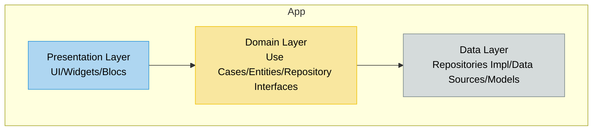
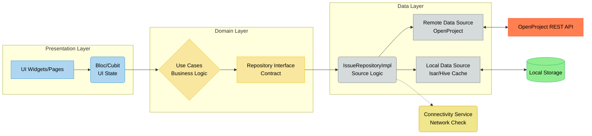
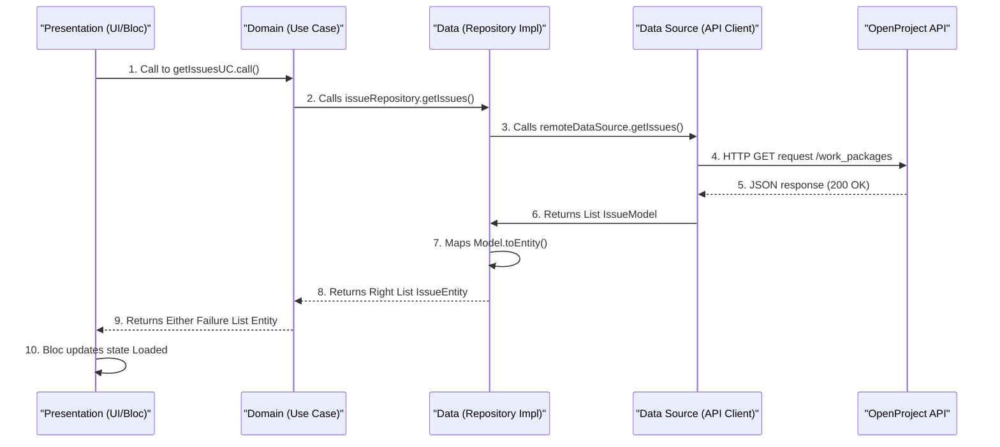

# SIREN: Preliminary Design Review Document (PDR)

**Project:** SIREN (System for Issue Reporting and Engineering Notification)  
**Version:** 1.0 (PDR)  
**Date:** November 13, 2025

## 1. Overview and Project Specifications

The SIREN project is a mobile application developed in Flutter with the primary objective of formalizing and accelerating the management of technical issues in the critical infrastructure of an astronomical observatory.

The focus is on reducing Mean Time to Resolution (MTTR) through immediate in-situ reporting and centralizing fault communication.

| Specification | Detail |
|---------------|--------|
| **Primary Objective** | Reduce MTTR through rapid triage and issue notification. |
| **Platform** | Mobile (iOS and Android) - Single Codebase. |
| **Backend (Source of Truth)** | OpenProject REST API (local server). |
| **Architecture** | Clean Architecture (DDD principles). |
| **MVP State** | Direct API connection. |
| **Post-MVP State** | Offline Support and Synchronization. |

## 2. System Requirements

### 2.1. Functional Requirements (FR)

| ID | Requirement | Description | Priority | Phase |
|----|-------------|-------------|----------|-------|
| FR001 | Authentication | Users must be able to authenticate against the OpenProject API (Token/Basic Auth). | High | MVP |
| FR002 | Issue Listing | Display the list of issues (Work Packages) relevant to the user. | High | MVP |
| FR003 | Issue Creation | Form for immediate reporting of new issues (includes Title, Group, Severity). | High | MVP |
| FR004 | Issue Update | Ability to modify the status and content of an existing issue. | Medium | MVP |
| FR005 | Group Filtering | Users should only view issues associated with their authorized Groups/Departments. | High | MVP |
| FR006 | Attachment Support | Ability to attach photos or documents when creating/updating an issue. | Medium | Post-MVP |
| FR007 | Offline Mode | Ability to create and modify issues locally without connection. | High | Post-MVP |
| FR008 | Synchronization | Mechanism to synchronize local changes with the OpenProject API when connection is restored. | High | Post-MVP |

### 2.2. Non-Functional Requirements (NFR)

| ID | Requirement | Category | Specification |
|----|-------------|----------|---------------|
| NFR001 | Performance | Performance | List loading times < 2 seconds under optimal network conditions. |
| NFR002 | Security | Storage | Authentication token must be stored securely (flutter_secure_storage). |
| NFR003 | Security | Access | Access control must be enforced by the OpenProject API (filtered by Group). |
| NFR004 | Usability (UI/UX) | Design | Mobile-first interface, intuitive and optimized for small screens. |
| NFR005 | Robustness | Errors | Network error handling with clear messages to the user (e.g., "Connection Lost"). |
| NFR006 | Maintainability | Architecture | Strict adherence to Clean Architecture and Dart/Flutter conventions. |

## 3. Application Architecture

The application will be built under the Clean Architecture pattern to ensure separation of concerns, ease of unit testing, and decoupling from the framework (Flutter). The strict dependency rule will apply: inner layers are independent of outer layers.

### 3.1. Layer Diagram (Overview)

This diagram shows the hierarchical separation and unidirectional dependency flow between the three main layers of Clean Architecture.



### 3.2. Detailed Architecture (Including Offline Mode and Dual Source)

This diagram illustrates the complete architecture, highlighting how the Data Layer manages access to multiple sources (OpenProject API and Local Storage) to support offline mode (Post-MVP).



## 4. Technology Stack and Rationale

Technology selection is based on the need for development speed, native mobile performance, and robust implementation of Clean Architecture.

| Technology | Category | Rationale |
|------------|----------|-----------|
| Flutter / Dart | Framework | Enables a single codebase for iOS and Android, offering near-native performance and a mature ecosystem. |
| Bloc / Cubit | State Management | Provides predictable, testable, and scalable state management that aligns perfectly with Clean Architecture. |
| OpenProject API | Backend | Mandatory integration requirement to centralize "Work Packages" management. |
| http or dio | HTTP Client | Robust library for handling REST communication, authentication headers, and error handling. |
| get_it | Dependency Injection | Simple and efficient Dependency Injection container for registering layers (DataSource, Repository, Use Cases). |
| Isar / Hive | Local Database | Selected for Post-MVP due to their high performance and ease of use with Dart, key for Offline functionality. |
| flutter_secure_storage | Security | Required to comply with NFR002, storing the API token securely at the native level. |

## 5. Project Structure

The project will adopt a "features"-based structure following the principles of the imposed architecture.

```
/lib
├── /core
│   ├── /di                 # Dependency Injection (get_it)
│   ├── /error              # Custom failures (Failure classes)
│   └── /i18n               # Internationalization (Post-MVP)
│
├── /features
│   └── /issues          # Main feature: Issue Management
│       ├── /data           # Implementation of Models, Sources and Repositories
│       ├── /domain         # Entities, Interfaces and Use Cases (Pure Dart)
│       └── /presentation   # Blocs, Pages (UI) and Widgets
│
└── main.dart               # Application entry point
```

## 6. Data Flow and Key Patterns

To ensure compliance with Clean Architecture, all UI interactions with business logic must go through a Use Case. The Use Case is the entry point to specific business logic and mediates between Presentation and Repository.

### 6.1. Data Reading Flow Diagram (Mermaid)

This diagram illustrates the flow when requesting the issue list, showing how the request and result (success or failure) propagate through the layers.



### 6.2. Error Handling Patterns

The Either or Result pattern will be used to handle errors explicitly and force error handling across all layers.

- **Domain:** Defines generic failures (Failure).
- **Data:** Maps network exceptions (DioError, TimeoutException) to specific failures (e.g., ServerFailure, NetworkFailure).
- **Presentation:** The Bloc or Cubit receives `Either<Failure, T>` and manages the error state (e.g., displays a message to the user).

## 7. Testing Strategy and Code Quality

### 7.1. Test Coverage

Emphasis will be placed on testing the core layers, as they contain critical business logic:

- **Unit Tests:** High coverage (80%+) for:
  - **Use Cases:** Validation of business logic and preconditions.
  - **Repositories:** Verification of data flow, error handling, and Model to Entity mapping.
  - **Data Sources:** Testing of simulated API calls and exception handling.
- **Widget Tests:** For complex UI components.
- **Integration Tests:** To verify complete application flows.

### 7.2. Quality Tools

- **Mocking:** Use of mockito or mocktail to isolate dependencies, focusing on mocking interfaces (e.g., IssueRepository in Use Case tests).
- **Analysis:** Mandatory use of `flutter analyze` and strict adherence to Effective Dart rules.
- **Formatting:** Mandatory use of `flutter format .` to maintain consistent code style.

## 8. Post-MVP Considerations (Offline Mode)

The transition to offline capability (FR007, FR008) will be carried out with the following architectural points already defined:

- **Modified Repository:** The `IssueRepositoryImpl` will be modified to manage dual-source logic (local first/API fallback, or API first/API fallback if no local data exists).
- **Transactions:** A "Write-Through" mechanism or similar will be implemented to ensure that issues created without connection are marked and automatically sent to OpenProject as soon as connectivity is restored.
- **Connectivity Detection:** Use of libraries such as `connectivity_plus` to monitor network status and inform the Presentation layer and the Synchronization Use Case.
