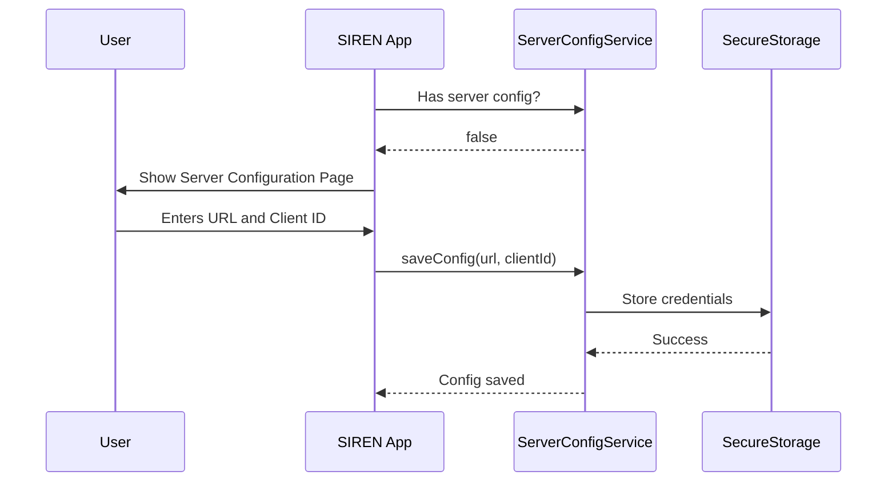
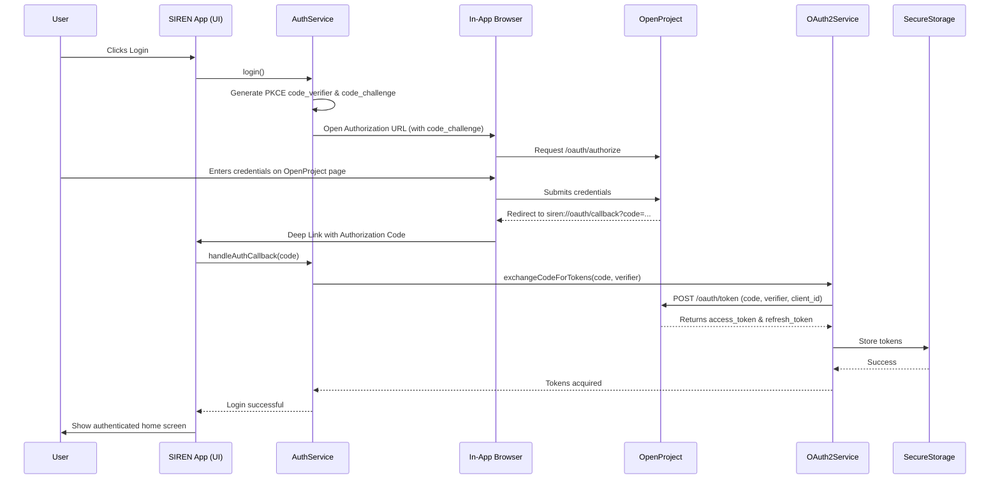
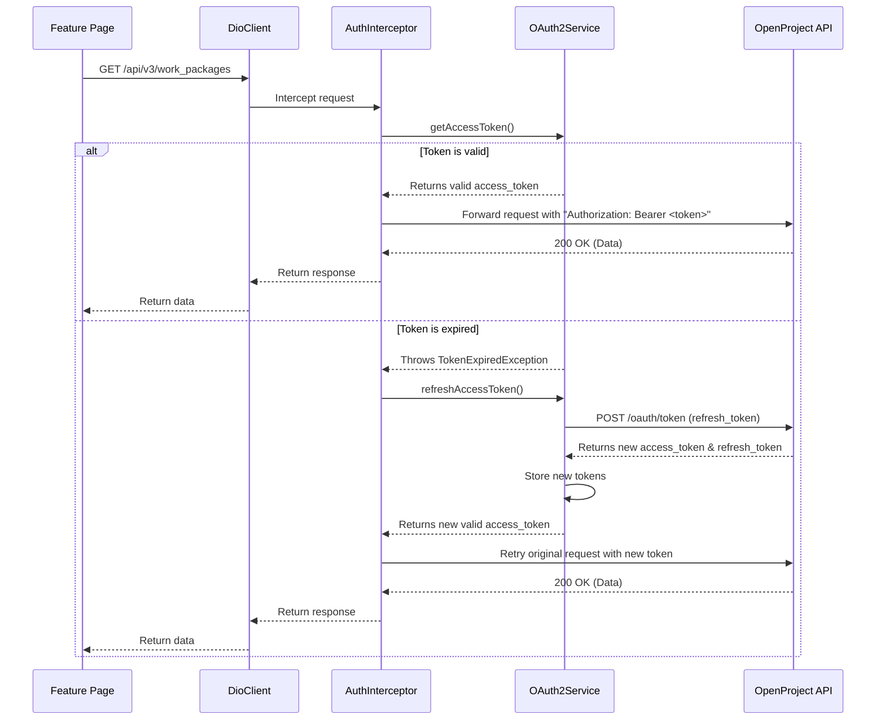

# SIREN Application: Architecture and Operational Flow

## 1. Introduction

This document provides a detailed explanation of the SIREN application's current architecture and primary operational flows. SIREN is a cross-platform mobile application built with Flutter, designed to act as a client for an **OpenProject** server instance.

The primary goal of this document is to onboard new developers to the project by clarifying its technical foundations and current implementation status.

## 2. Core Architecture

The application is built upon a modern, scalable, and maintainable architecture.

-   **Framework**: [Flutter](https://flutter.dev/) for cross-platform (iOS/Android/Web/Desktop) development.
-   **Language**: [Dart](https://dart.dev/).
-   **Architecture Style**: Feature-driven. Code is organized into a shared `core` module and distinct `features` modules.
    -   `lib/core`: Contains shared logic for authentication, network, dependency injection, etc.
    -   `lib/features`: Contains self-contained feature modules (e.g., `config`, `issues`).
-   **Dependency Injection (DI)**: We use the [`get_it`](https://pub.dev/packages/get_it) package for service location and decoupling. All major services (authentication, configuration, API clients) are registered at app startup and accessed throughout the app via the DI container. This is configured in `lib/core/di/injection.dart`.
-   **HTTP Client**: We use the [`dio`](https://pub.dev/packages/dio) package for all network communications. A central `DioClient` factory in `lib/core/network/dio_client.dart` creates pre-configured instances for communicating with the OpenProject API v3.

---

## 3. Operational Flows

This section details the primary user and data flows currently implemented in the application.

### Flow 1: First-Time Setup & Server Configuration

On its first launch, the application requires the user to configure it to point to their OpenProject instance.

1.  The app starts and checks for a saved server configuration.
2.  If no configuration is found, the user is mandatorily redirected to the `ServerConfigPage`.
3.  The user enters the **Server URL** and the **OAuth2 Client ID**.
4.  This configuration is securely saved to the device's local storage for all future sessions.

### Flow 2: User Authentication (OAuth2 PKCE Flow)

Once the server is configured, the user can log in. The application implements the secure **OAuth2 Authorization Code Flow with PKCE**.

1.  The user is presented with a "Login" button.
2.  Tapping it initiates the `AuthService`, which generates a `code_verifier` and `code_challenge` for the PKCE flow.
3.  The app opens an in-app browser window, directing the user to the OpenProject server's authorization URL.
4.  The user enters their credentials **directly on the OpenProject webpage**. The SIREN application never sees or handles the user's password.
5.  Upon successful login, OpenProject redirects to a custom deep link (`siren://oauth/callback`) with a temporary `authorization_code`.
6.  The SIREN app intercepts this deep link, extracts the code, and closes the browser.
7.  The `OAuth2Service` exchanges the `authorization_code` (along with the `code_verifier`) for a long-lived `refresh_token` and a short-lived `access_token`.
8.  These tokens are stored securely on the device using `flutter_secure_storage`.

### Flow 3: Making an Authenticated API Call

With a valid session, all subsequent API calls are automatically authenticated. This flow includes transparent token refreshing.

1.  A feature (e.g., an "Issues Page") requests data from the `DioClient`.
2.  The `AuthInterceptor` intercepts the outgoing request.
3.  It requests the `access_token` from the `OAuth2Service`.
4.  **Scenario A (Happy Path):** If the token is valid, it is attached to the `Authorization: Bearer <token>` header, and the request is sent to the OpenProject API.
5.  **Scenario B (Token Refresh):** If the `access_token` is expired, the `OAuth2Service` automatically uses the stored `refresh_token` to request a new pair of tokens from the server. The new tokens are stored, and the original, failed API request is **transparently retried** with the new `access_token`. The user is unaware of this process.

---

## 4. Current Implementation Status

-   **Server Configuration**: ✅ Fully implemented.
-   **Authentication (OAuth2+PKCE)**: ✅ Fully implemented.
-   **Secure Token Storage**: ✅ Fully implemented.
-   **Automatic Token Refresh**: ✅ Fully implemented.
-   **Authenticated API Client**: ✅ Fully implemented.
-   **Issues Feature** (`lib/features/issues`): ❌ **Scaffold only.** The directory structure exists, but no business logic, data fetching, or UI has been implemented. The post-login screen is a placeholder.

In summary, the application currently serves as a robust and complete foundation for building out features that interact with an OpenProject instance. The entire authentication and session management layer is complete.
