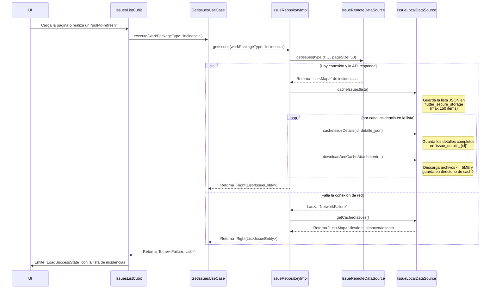
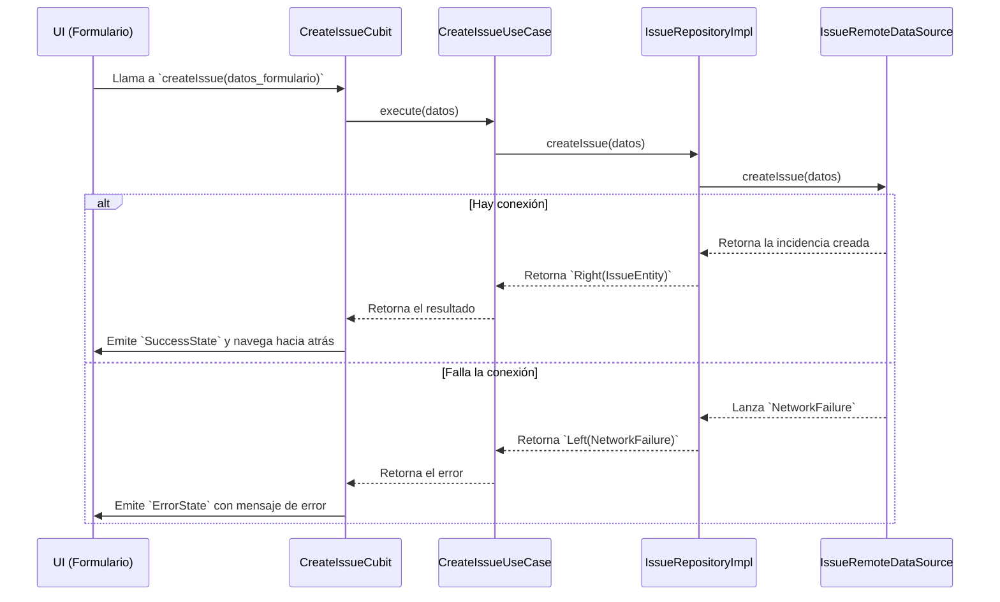
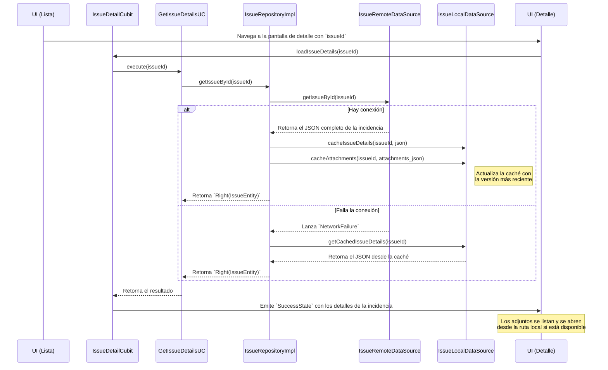
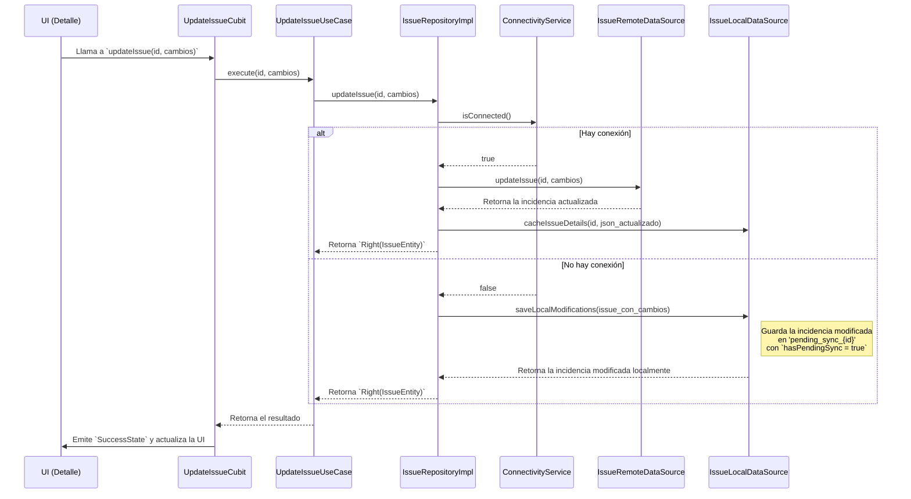

# SIREN: Arquitectura y Flujo Operacional

## 1. Introducción

Este documento detalla la arquitectura de la aplicación SIREN y sus flujos operativos principales. SIREN es una aplicación móvil multiplataforma desarrollada con Flutter, diseñada como cliente para una instancia del servidor **OpenProject**.

El objetivo es servir como una guía técnica para los desarrolladores, clarificando las bases del proyecto y su implementación actual.

## 2. Arquitectura del Núcleo

La aplicación se fundamenta en una **Arquitectura Limpia (Clean Architecture)** de tres capas, adaptada al ecosistema de Flutter. Este enfoque promueve la separación de responsabilidades, la testeabilidad y la mantenibilidad del código.

```mermaid
graph TD
    subgraph Presentation Layer
        A[Widgets] --> B[BLoCs / Cubits];
    end

    subgraph Domain Layer
        C[Use Cases] --> D[Repositories (Abstract)];
        E[Entities]
    end

    subgraph Data Layer
        F[Repositories (Implementation)] --> G[DataSources (API/Local)];
        H[DTOs]
    end

    B --> C;
    C --> D;
    F --> D;
    G --> F;

    style Presentation Layer fill:#cde4ff,stroke:#6b95ff,stroke-width:2px
    style Domain Layer fill:#d5e8d4,stroke:#82b366,stroke-width:2px
    style Data Layer fill:#f8cecc,stroke:#b85450,stroke-width:2px
```

### 2.1. Capas de la Arquitectura

#### A. Capa de Presentación (Presentation)
-   **Responsabilidad**: Todo lo relacionado con la UI y la gestión del estado.
-   **Contenido**:
    -   **Widgets (UI)**: Componentes visuales construidos con el framework de Flutter.
    -   **State Management (BLoCs/Cubits)**: Orquesta los eventos de la UI, invoca los casos de uso y emite estados para que la UI los renderice. Utilizamos `flutter_bloc` para este propósito.
-   **Dependencia**: Depende de la capa de Dominio.

#### B. Capa de Dominio (Domain)
-   **Responsabilidad**: Contiene la lógica de negocio central y las reglas de la aplicación. Es el corazón de la aplicación y es totalmente independiente de cualquier framework de UI o de acceso a datos.
-   **Contenido**:
    -   **Entities**: Objetos de negocio puros (ej. `Issue`, `Project`).
    -   **Repositories (Abstracciones)**: Interfaces que definen los contratos para la obtención y manipulación de datos (ej. `IssueRepository`).
    -   **Use Cases (Casos de Uso)**: Encapsulan una única pieza de lógica de negocio, coordinando el flujo de datos desde los repositorios.
-   **Dependencia**: No tiene dependencias de otras capas.

#### C. Capa de Datos (Data)
-   **Responsabilidad**: Implementa los contratos definidos en la capa de Dominio, manejando el origen de los datos (red, base de datos local, etc.).
-   **Contenido**:
    -   **Repositories (Implementaciones)**: Implementaciones concretas de las interfaces del repositorio de la capa de Dominio.
    -   **DataSources**: Clases responsables de comunicarse con una fuente de datos específica (ej. `ApiDataSource` para la API REST, `LocalDataSource` para la caché).
    -   **DTOs (Data Transfer Objects)**: Modelos que representan la estructura de los datos de la API, y que son mapeados a Entidades de Dominio.
-   **Dependencia**: Depende de la capa de Dominio.

### 2.2. Tecnologías y Librerías Clave
-   **Framework**: [Flutter](https://flutter.dev/) y [Dart](https://dart.dev/).
-   **Gestión de Estado**: [`flutter_bloc`](https://pub.dev/packages/flutter_bloc) para un manejo de estado reactivo y predecible.
-   **Inyección de Dependencias (DI)**: [`get_it`](https://pub.dev/packages/get_it) junto con [`injectable`](https://pub.dev/packages/injectable) para la localización de servicios y la generación automática del grafo de dependencias.
-   **Cliente HTTP**: [`dio`](https://pub.dev/packages/dio) para la comunicación de red, con interceptores para la gestión de autenticación y logs.
-   **Programación Funcional**: [`dartz`](https://pub.dev/packages/dartz) para el manejo de errores y resultados, utilizando `Either` para representar operaciones que pueden resultar en un éxito (`Right`) o un fallo (`Left`).
-   **Almacenamiento Local**: [`flutter_secure_storage`](https://pub.dev/packages/flutter_secure_storage) para almacenar metadatos en formato JSON y [`path_provider`](https://pub.dev/packages/path_provider) para guardar archivos (adjuntos) en el directorio de caché de la aplicación.

---

## 3. Flujos Operacionales

### 3.1. Configuración Inicial y Autenticación
Los flujos de configuración del servidor y autenticación de usuario (OAuth2 + PKCE) son la base sobre la cual operan todas las demás funcionalidades de la aplicación.
*(Diagramas de `sequenceDiagram` para Configuración, Autenticación y Llamada a API con Refresco de Token se omiten aquí por brevedad, pero se mantienen del documento original).*

---
## 4. Flujos Detallados de la Feature 'Incidencias'

Esta sección detalla la implementación de la funcionalidad principal de la aplicación: la gestión de incidencias.

### 4.1. Listado de Incidencias y Funcionamiento Offline

Este flujo describe cómo la aplicación carga la lista de incidencias, aplicando filtros y garantizando el acceso sin conexión a los datos.

**Detalles Técnicos:**
-   **Paginación**: La API de OpenProject se consulta con un tamaño de página por defecto de **50 incidencias** (`pageSize = 50`).
-   **Filtro**: El `workPackageType` seleccionado en la configuración de la app se resuelve a su `ID` correspondiente y se aplica como filtro en la llamada a la API.
-   **Estrategia "Offline-First"**: El `IssueRepositoryImpl` primero intenta obtener los datos del `IssueRemoteDataSource`. Si falla por un error de red (`NetworkFailure`), automáticamente intenta cargar la lista desde el `IssueLocalDataSource`.
-   **Caché Local**: Si la llamada a la red es exitosa, la lista de incidencias obtenida se guarda en `flutter_secure_storage` como un JSON bajo la clave `cached_issues`. La caché se limita a **150 incidencias** para controlar el uso del almacenamiento.
-   **Caché de Detalles y Adjuntos**: Por cada incidencia en la lista obtenida, la aplicación:
    1.  Guarda los detalles completos de la incidencia en una clave separada (`issue_details_{id}`).
    2.  Descarga y guarda localmente cada adjunto cuyo tamaño sea **menor o igual a 5MB**. Los archivos se almacenan en el directorio de caché de la app.



### 4.2. Creación de una Nueva Incidencia (Solo Online)

La creación de una nueva incidencia requiere una conexión activa a internet y no se puede realizar en modo offline.

**Detalles Técnicos:**
-   El `IssueRepositoryImpl` invoca directamente al `IssueRemoteDataSource` para realizar la llamada a la API de creación.
-   No existe un mecanismo de "cola de creación" para sincronizar más tarde. Si la llamada falla por falta de conexión, el usuario recibe un error.



### 4.3. Visualización de Detalles y Adjuntos

Al seleccionar una incidencia, la aplicación intenta obtener la versión más reciente del servidor, pero recurre a la caché si no hay conexión, garantizando el acceso a los datos y adjuntos previamente descargados.



### 4.4. Actualización de una Incidencia (Online/Offline)

La modificación de una incidencia (cambiar estado, descripción, etc.) es una operación robusta que funciona tanto online como offline.

**Detalles Técnicos:**
-   **Modo Online**: Si hay conexión, la app llama directamente a la API para actualizar la incidencia.
-   **Modo Offline**: Si no hay conexión, el `IssueRepositoryImpl` guarda una copia de la incidencia con los cambios aplicados en `flutter_secure_storage` bajo una clave especial: `pending_sync_{issueId}`. A la incidencia se le añade una bandera `hasPendingSync: true`.
-   **Sincronización**: La lógica para iniciar la sincronización de los cambios pendientes (cuando la conexión se restablece) debe ser implementada en la capa de presentación (UI/BLoC), por ejemplo, al iniciar la app o al volver a la lista de incidencias.



---
## 5. Estado Actual de la Implementación

-   **Fundamento Arquitectónico**: ✅ Sólido y completamente implementado.
-   **Configuración del Servidor**: ✅ Funcional.
-   **Autenticación (OAuth2+PKCE)**: ✅ Funcional.
-   **Almacenamiento Seguro de Tokens**: ✅ Funcional.
-   **Refresco Automático de Tokens**: ✅ Funcional.
-   **Feature de Incidencias (`issues`)**: ✅ Implementada con las siguientes características:
    -   Listado de incidencias con estrategia "offline-first".
    -   Caché local de lista, detalles y adjuntos.
    -   Creación de incidencias (solo online).
    -   Actualización de incidencias (con capacidad offline y sincronización pendiente).
    -   Visualización de detalles y adjuntos (online/offline).