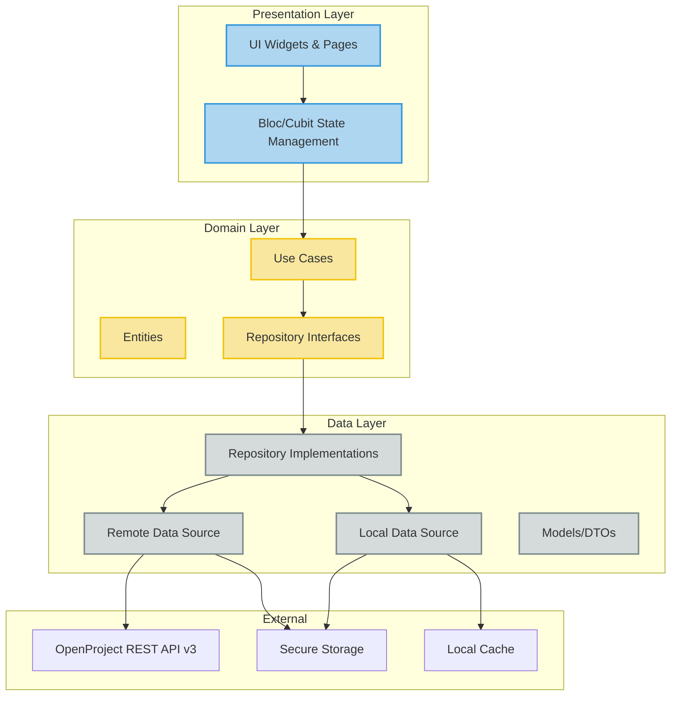
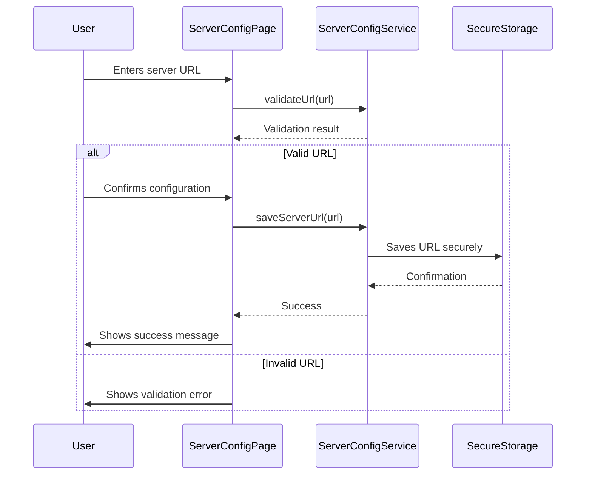
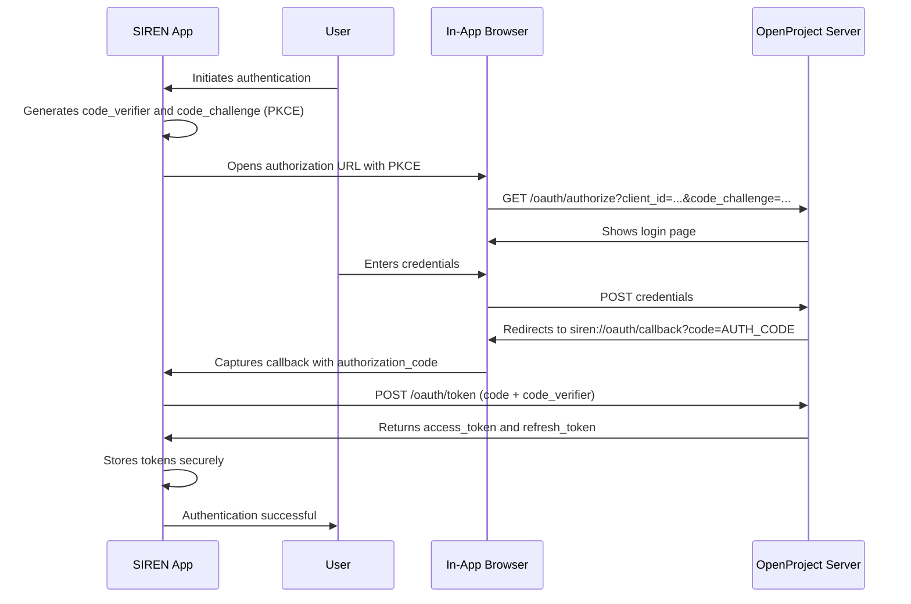
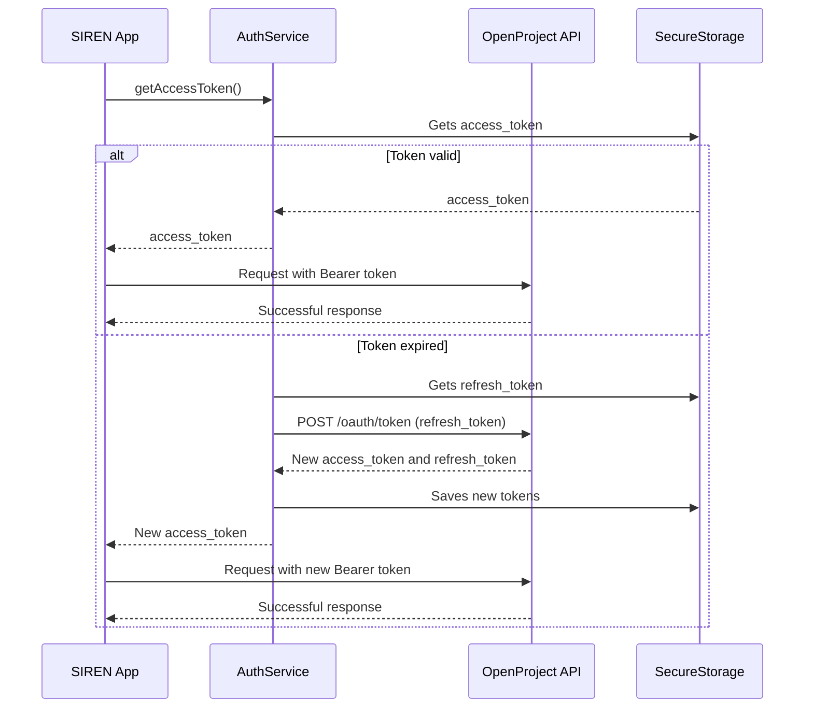
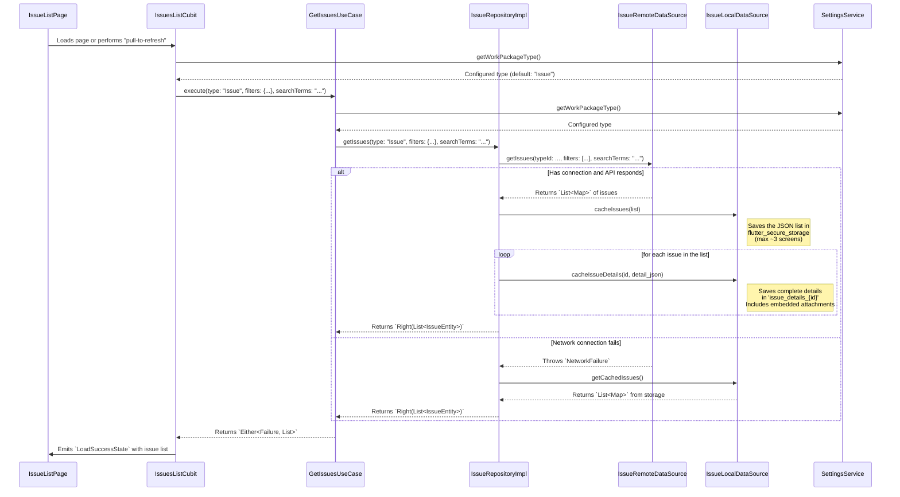
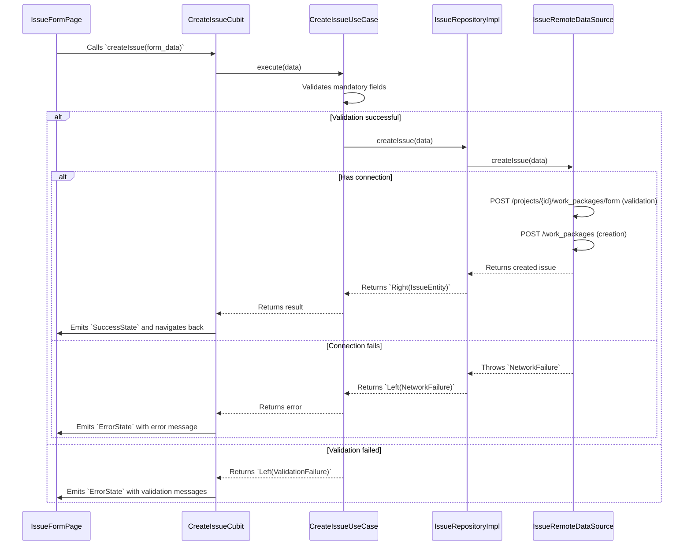
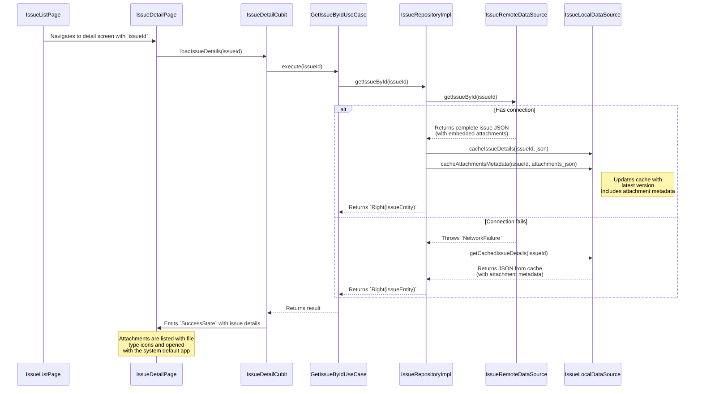
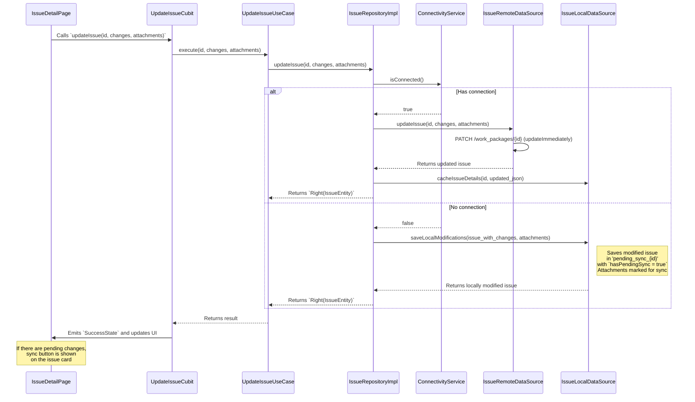
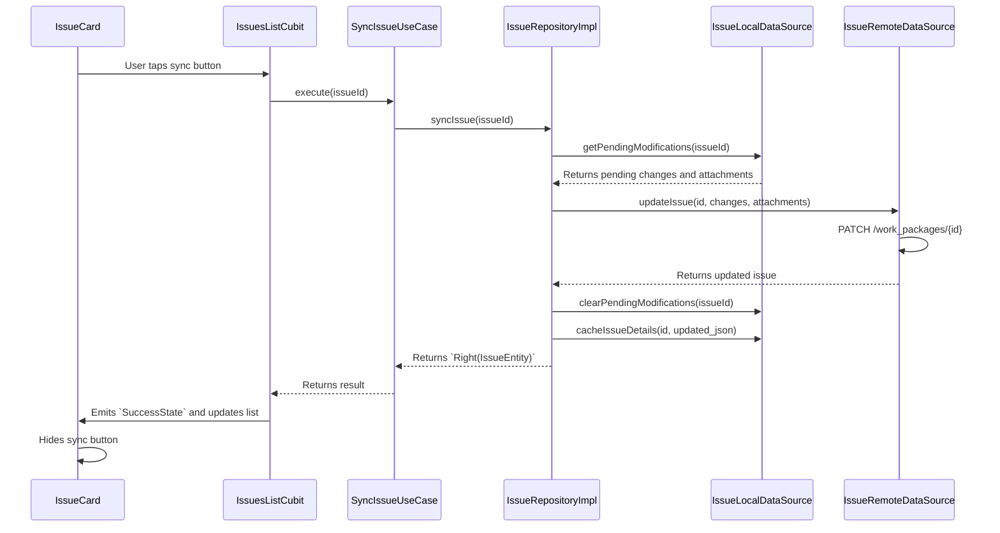

# SIREN: Complete Project Overview

## 1. Introduction

This document details the complete architecture of the SIREN application and its main operational flows. SIREN (System for Issue Reporting and Engineering Notification) is a multiplatform mobile application developed with Flutter, designed as a client for an **OpenProject** server instance.

The goal is to serve as a complete technical guide for developers, clarifying the project foundations, its current implementation, and the status of all developed phases.

**Project Status:** MVP Complete (Phases 1-5 implemented)

---

## 2. Core Architecture

The application is based on a **Clean Architecture** of three layers, adapted to the Flutter ecosystem. This approach promotes separation of concerns, testability, and code maintainability.



### 2.1. Architecture Layers

#### A. Presentation Layer
- **Responsibility**: Everything related to UI and state management.
- **Content**:
  - **Widgets (UI)**: Visual components built with Flutter and Material Design 3.
  - **State Management (BLoCs/Cubits)**: Orchestrates UI events, invokes use cases, and emits states for the UI to render. We use `flutter_bloc` for this purpose.
- **Dependency**: Depends on the Domain layer.

#### B. Domain Layer
- **Responsibility**: Contains the core business logic and application rules. It is the heart of the application and is completely independent of any UI framework or data access.
- **Content**:
  - **Entities**: Pure business objects (e.g., `IssueEntity`, `PriorityLevel`, `IssueStatus`).
  - **Repositories (Abstractions)**: Interfaces that define contracts for data retrieval and manipulation (e.g., `IssueRepository`).
  - **Use Cases**: Encapsulate a single piece of business logic, coordinating data flow from repositories.
- **Dependency**: Has no dependencies on other layers (Pure Dart).

#### C. Data Layer
- **Responsibility**: Implements the contracts defined in the Domain layer, handling data sources (network, local database, etc.).
- **Content**:
  - **Repositories (Implementations)**: Concrete implementations of repository interfaces from the Domain layer.
  - **DataSources**: Classes responsible for communicating with a specific data source:
    - `IssueRemoteDataSource` for OpenProject REST API
    - `IssueLocalDataSource` for local cache (MVP)
  - **DTOs (Data Transfer Objects)**: Models that represent the API data structure (e.g., `IssueModel`), which are mapped to Domain Entities.
- **Dependency**: Depends on the Domain layer.

### 2.2. Key Technologies and Libraries

| Category | Technology | Purpose |
|----------|-----------|---------|
| **Framework** | Flutter 3.0+ / Dart 3.0+ | Multiplatform framework |
| **State Management** | `flutter_bloc` | Reactive and predictable state handling |
| **Dependency Injection** | `get_it` + `injectable` | Service location and automatic dependency graph generation |
| **HTTP Client** | `dio` | Network communication with interceptors for authentication and logs |
| **Functional Programming** | `dartz` | Error handling with `Either<Failure, T>` (Result pattern) |
| **Secure Storage** | `flutter_secure_storage` | Secure storage of tokens, configuration, and cache |
| **In-App Browser** | `flutter_inappwebview` | Secure browser for OAuth2 |
| **Deep Links** | `app_links` | OAuth2 callback handling (`siren://oauth/callback`) |
| **Cryptography** | `crypto` | PKCE generation (code_verifier, code_challenge) |
| **Testing** | `flutter_test`, `mockito`/`mocktail` | Testing framework and mocking |

---

## 3. Main Operational Flows

### 3.1. Initial Configuration and Authentication

Server configuration and user authentication flows (OAuth2 + PKCE) are the foundation on which all other application functionalities operate.

#### 3.1.1. Server Configuration



#### 3.1.2. OAuth2 + PKCE Authentication



#### 3.1.3. API Call with Automatic Token Refresh



---

## 4. Detailed Flows of the 'Issues' Feature

This section details the complete implementation of the application's main functionality: issue management.

### 4.1. Issue Listing with Filtering and Search

This flow describes how the application loads the issue list, applying filters (including Work Package type), text search, and ensuring offline access to data.

**Technical Details:**
- **Pagination**: The OpenProject API is queried with a default page size of **50 issues** (`pageSize = 50`).
- **Type Filter**: The `workPackageType` selected in the app configuration (default: "Issue") is resolved to its corresponding `ID` and applied as a filter in the API call. This filter is always present and cannot be overridden.
- **Additional Filters**: Users can filter by:
  - **Status**: Multiple selection of dynamically loaded statuses
  - **Equipment/Project**: Selection of specific projects
  - **Priority**: Multiple selection (Low, Normal, High, Immediate)
  - **Group**: Single group selection
- **Text Search**: Case-insensitive search in Subject (title) and Description, with partial word matching. Combined with other filters using AND logic.
- **"Offline-First" Strategy**: The `IssueRepositoryImpl` first attempts to obtain data from `IssueRemoteDataSource`. If it fails due to a network error (`NetworkFailure`), it automatically attempts to load the list from `IssueLocalDataSource`.
- **Local Cache (MVP)**: If the network call is successful, the obtained issue list is saved in `flutter_secure_storage` as JSON under the key `cached_issues`. The cache is limited to approximately **3 screens** (150 issues) to control storage usage.
- **Details and Attachments Cache**: For each issue in the obtained list, the application:
  1. Saves the complete issue details in a separate key (`issue_details_{id}`).
  2. Saves attachment metadata (name, size, type, download URL) for offline viewing.
  3. Attachments are extracted directly from the work package response (`_embedded.attachments._embedded.elements`) to optimize API calls.



### 4.2. Creating a New Issue

Creating a new issue requires an active internet connection and cannot be performed offline (MVP).

**Technical Details:**
- **Validation**: The `CreateIssueUseCase` validates the four mandatory fields:
  - Subject (title)
  - Priority Level
  - Group
  - Equipment
- **Two-Step Flow**: The OpenProject API uses a two-step flow:
  1. **Validation**: `POST /api/v3/projects/{id}/work_packages/form` - Validates data
  2. **Execution**: `POST /api/v3/work_packages` - Creates the issue with validated payload
- **Dynamic Filtering**: The Equipment field is filtered dynamically based on the selected Group.
- **Auto-selection**: If the user belongs to a single group, it is automatically selected.
- **The `IssueRepositoryImpl` directly invokes `IssueRemoteDataSource` to perform the creation API call.



### 4.3. Viewing Details and Attachments

When selecting an issue, the application attempts to obtain the latest version from the server, but falls back to cache if there's no connection, ensuring access to previously downloaded data and attachments.

**Technical Details:**
- **API Optimization**: Attachments are extracted directly from the work package response (`_embedded.attachments._embedded.elements`), reducing API calls from 2 to 1.
- **Fallback**: If embedded attachments are not available, the separate endpoint `GET /api/v3/work_packages/{id}/attachments` is used.
- **Relative to Absolute URLs**: Relative attachment URLs are converted to absolute for mobile compatibility.
- **Offline Viewing**: Attachment metadata is displayed from cache when there's no connection.



### 4.4. Updating an Issue (Online/Offline)

Modifying an issue (changing status, description, priority, etc.) is a robust operation that works both online and offline (MVP with manual synchronization).

**Technical Details:**
- **Online Mode**: If there's a connection, the app directly calls the API to update the issue using `PATCH /api/v3/work_packages/{id}` with the `updateImmediately` endpoint.
- **Offline Mode**: If there's no connection, `IssueRepositoryImpl` saves a copy of the issue with applied changes in `flutter_secure_storage` under a special key: `pending_sync_{issueId}`. The issue is marked with a flag `hasPendingSync: true`.
- **Optimistic Locking**: `lockVersion` is used to prevent concurrent modification conflicts.
- **Manual Synchronization**: Synchronization of pending changes is performed manually through sync buttons on issue cards. Changes are synchronized when the user taps the sync button.
- **Change Cancellation**: Users can discard local pending changes through a cancel button, restoring the original server version from cache.
- **Attachments in Editing**: Users can add new attachments (photos/documents) when editing an issue. Attachments are uploaded when the issue is saved (online) or marked for synchronization (offline).



### 4.5. Manual Synchronization of Pending Changes

When an issue has offline pending modifications, the user can synchronize them manually.



---

## 5. Status Management and Work Package Types

### 5.1. Work Package Type Selection

The application allows selecting the Work Package type to display (default: "Issue"). This type is stored securely and used to filter all API queries.

**Features:**
- **Secure Storage**: The selected type is saved in `flutter_secure_storage`.
- **Dynamic Resolution**: The type name is dynamically resolved to its corresponding ID in OpenProject.
- **Cache Invalidation**: When the type changes, cached statuses are invalidated and available statuses for the new type are reloaded.
- **Always Applied Filter**: The type filter is always present in all API queries and cannot be overridden by user filters.

### 5.2. Dynamic Status Management

Statuses are loaded dynamically based on the configured Work Package type.

**Features:**
- **Load by Type**: Each Work Package type can have different available statuses.
- **Colors from API**: Status colors are obtained from OpenProject API (`color.hexcode` or `hexCode`).
- **Local Cache**: Statuses are cached locally for offline use.
- **Update**: Statuses are updated when:
  - Work Package type changes
  - Issue list is updated (pull to refresh)
- **No Hardcoding**: No hardcoded status names/IDs/colors are used; everything is loaded dynamically.

---

## 6. Current Implementation Status

### 6.1. Completed Phases (MVP)

#### ✅ Phase 1: Setup / Foundational (7/7 tasks completed)
- **Architectural Foundation**: ✅ Solid and completely implemented
- **Dependency Injection System**: ✅ Implemented with `get_it` and `injectable`
- **Error Handling**: ✅ Complete system with `Result<Failure, T>`
- **Domain Entities**: ✅ `IssueEntity` with priority and status enums
- **Repository Interfaces**: ✅ `IssueRepository` defined
- **Data Sources**: ✅ `IssueRemoteDataSource` implemented
- **Base Authentication**: ✅ Infrastructure prepared

#### ✅ Phase 2: Configuration and Testing Infrastructure (13/13 tasks completed)
- **Server Configuration**: ✅ Functional with URL validation
- **Authentication (OAuth2+PKCE)**: ✅ Functional with complete flow
- **Secure Token Storage**: ✅ Functional with `flutter_secure_storage`
- **Automatic Token Refresh**: ✅ Functional
- **Initial Configuration Screen**: ✅ Implemented
- **Settings Screen**: ✅ Implemented with logout
- **Initialization Logic**: ✅ Implemented
- **Testing Infrastructure**: ✅ Configured with mocks and fixtures

#### ✅ Phase 3: Quick Issue Registration (9/9 tasks completed)
- **IssueModel (DTO)**: ✅ Implemented with HATEOAS mapping
- **createIssue in RemoteDataSource**: ✅ Implemented with two-step flow
- **CreateIssueUseCase**: ✅ Implemented with validation
- **IssueFormPage UI**: ✅ Implemented with Material Design 3
- **State Management (Bloc/Cubit)**: ✅ Implemented
- **Validation and Error Handling**: ✅ Implemented
- **Dynamic Filtering**: ✅ Group and Equipment filtered dynamically
- **Auto-selection of Group**: ✅ Implemented
- **Navigation and FAB**: ✅ Implemented

#### ✅ Phase 4: Issue Lifecycle Management (22/24 tasks completed, 2 Post-MVP)
- **Issue Listing**: ✅ Implemented with type filtering
- **IssueListPage UI**: ✅ Implemented with Material Design 3
- **IssueCard Widget**: ✅ Implemented with visual indicators
- **IssueDetailPage UI**: ✅ Implemented (read and edit modes)
- **Issue Editing**: ✅ Implemented with validation
- **Issue Updates**: ✅ Implemented (online/offline)
- **Attachment Support**: ✅ Implemented (add, view)
- **Offline Cache (MVP)**: ✅ Implemented for list, details, and attachments
- **Manual Synchronization**: ✅ Implemented with sync/cancel buttons
- **Dynamic Status Management**: ✅ Implemented based on Work Package type
- **Work Package Type Selection**: ✅ Implemented in Settings
- **Attachment Optimization**: ✅ Embedded attachments reduce API calls

#### ✅ Phase 5: Issue Search and Filtering (5/5 tasks completed)
- **Multi-criteria Filtering**: ✅ Implemented (Status, Equipment, Priority, Group)
- **Text Search**: ✅ Implemented in Subject and Description
- **AND Logic**: ✅ All filters combined with AND
- **Type Filter Always Applied**: ✅ Implemented and non-overridable
- **Filtering UI**: ✅ Implemented with modal/sheet
- **Real-time Search**: ✅ Implemented with debouncing

### 6.2. Implemented Features

#### Issue Management
- ✅ **Issue listing** with "offline-first" strategy
- ✅ **Local cache** of list, details, and attachment metadata (MVP)
- ✅ **Issue creation** (online only, MVP)
- ✅ **Issue updates** (with offline capability and manual synchronization)
- ✅ **Details and attachment viewing** (online/offline)
- ✅ **Advanced filtering** by multiple criteria
- ✅ **Text search** in titles and descriptions
- ✅ **Dynamic status management** based on Work Package type

#### Authentication and Configuration
- ✅ **OAuth2 + PKCE** for secure authentication
- ✅ **Server configuration** with validation
- ✅ **Secure storage** of tokens and configuration
- ✅ **Automatic token refresh**
- ✅ **Logout** with configuration preservation

#### UI/UX
- ✅ **Material Design 3** on all screens
- ✅ **Soft color scheme** (blues and purples)
- ✅ **Responsive design** for smartphones
- ✅ **Visual indicators** for priority and status
- ✅ **Clear feedback** for user actions

### 6.3. Pending Features (Post-MVP)

#### Phase 6: Architectural Preparation (Post-MVP)
- ⏳ Complete i18n implementation (structure prepared)
- ⏳ Complete offline-first architecture design
- ⏳ Preparation for AI integration
- ⏳ Voice command architecture

#### Phase 7: Offline Issue Management (Post-MVP)
- ⏳ Complete local database (Isar/Hive)
- ⏳ Automatic synchronization
- ⏳ Conflict resolution
- ⏳ Local storage of large attachments
- ⏳ Complete offline mode for issue creation

---

## 7. Project Structure

```
/lib
├── /core                    # Core infrastructure
│   ├── /auth               # OAuth2 + PKCE authentication
│   │   ├── auth_service.dart
│   │   └── auth_interceptor.dart
│   ├── /config             # Configuration
│   │   └── server_config_service.dart
│   ├── /di                 # Dependency injection
│   │   ├── di_container.dart
│   │   ├── injection.dart
│   │   └── /modules        # Injection modules
│   ├── /error              # Error handling
│   │   └── failures.dart
│   ├── /i18n               # Internationalization (prepared)
│   │   ├── /l10n
│   │   ├── localization_service.dart
│   │   └── localization_repository.dart
│   ├── /network            # Network configuration
│   │   └── dio_client.dart
│   └── /theme              # Application themes
│       └── app_colors.dart
│
├── /features                # Feature modules
│   ├── /config             # Configuration feature
│   │   └── /presentation
│   │       ├── /pages
│   │       │   ├── app_initialization_page.dart
│   │       │   ├── server_config_page.dart
│   │       │   └── settings_page.dart
│   │       └── /cubit
│   │           └── localization_cubit.dart
│   │
│   └── /issues             # Main feature: Issue management
│       ├── /data           # Data layer
│       │   ├── /datasources
│       │   │   ├── issue_remote_datasource.dart
│       │   │   └── issue_remote_datasource_impl.dart
│       │   ├── /models
│       │   │   └── issue_model.dart
│       │   └── /repositories
│       │       └── issue_repository_impl.dart
│       │
│       ├── /domain         # Domain layer (Pure Dart)
│       │   ├── /entities
│       │   │   └── issue_entity.dart
│       │   ├── /repositories
│       │   │   └── issue_repository.dart
│       │   └── /usecases
│       │       ├── create_issue_uc.dart
│       │       ├── get_issues_uc.dart
│       │       ├── get_issue_by_id_uc.dart
│       │       └── update_issue_uc.dart
│       │
│       └── /presentation   # Presentation layer
│           ├── /pages
│           │   ├── issue_list_page.dart
│           │   ├── issue_detail_page.dart
│           │   └── issue_form_page.dart
│           ├── /widgets
│           │   ├── issue_card.dart
│           │   ├── issue_filter_sheet.dart
│           │   └── attachment_list_item.dart
│           └── /cubit
│               ├── issues_list_cubit.dart
│               ├── issue_detail_cubit.dart
│               └── create_issue_cubit.dart
│
└── main.dart                # Application entry point

/test                        # Tests
├── /core
│   ├── /mocks              # Mock implementations
│   └── /fixtures           # Test data
└── /features
    └── /issues              # Tests by layer
        ├── /domain
        ├── /data
        └── /presentation
```

---

## 8. Design Patterns and Principles

### 8.1. Clean Architecture
- **Strict layer separation**: Each layer has clear responsibilities
- **Unidirectional dependency**: Inner layers do not depend on outer layers
- **Pure Domain**: The domain layer is independent of frameworks

### 8.2. Result Pattern
- **Functional error handling**: Use of `Result<Failure, T>` (equivalent to `Either<Failure, T>`)
- **No exceptions in use cases**: Use cases never throw exceptions
- **Specific failure types**: `ServerFailure`, `NetworkFailure`, `ValidationFailure`, etc.

### 8.3. Dependency Injection
- **Constructor injection**: All dependencies are injected via constructor
- **Automatic generation**: Use of `injectable` to generate registration code
- **Modular modules**: Dependencies organized in modules by feature

### 8.4. State Management
- **Bloc/Cubit pattern**: Reactive and predictable state management
- **Immutable states**: Use of `Equatable` for state comparison
- **Logic separation**: Business logic is in use cases, not in Cubits

---

## 9. OpenProject API v3 Integration

### 9.1. Main Endpoints

| Method | Endpoint | Purpose |
|--------|----------|---------|
| `GET` | `/api/v3/work_packages` | List issues with filters |
| `GET` | `/api/v3/work_packages/{id}` | Get issue details |
| `POST` | `/api/v3/work_packages` | Create new issue |
| `PATCH` | `/api/v3/work_packages/{id}` | Update issue |
| `POST` | `/api/v3/work_packages/{id}/attachments` | Add attachments |
| `GET` | `/api/v3/statuses` | Get available statuses |
| `GET` | `/api/v3/priorities` | Get available priorities |
| `GET` | `/api/v3/projects` | Get projects (equipment) |
| `GET` | `/api/v3/groups` | Get user groups |
| `GET` | `/api/v3/types` | Get Work Package types |

### 9.2. HATEOAS Principles
- **Resource discovery**: Use of `_links` to navigate between resources
- **Relative URLs**: URLs in `_links` are relative and converted to absolute
- **No hardcoding**: URLs are not constructed manually, provided `_links` are used

### 9.3. Authentication
- **OAuth2 + PKCE**: Authorization flow with Proof Key for Code Exchange
- **Bearer Token**: Access tokens sent in `Authorization: Bearer {token}` header
- **Automatic refresh**: Automatic renewal of expired tokens

---

## 10. References and Documentation

### 10.1. Phase Documentation
- **Phase 1**: `docs/PHASE1_SETUP_DEVELOPMENT_SIREN_APP.md` - Setup and foundations
- **Phase 2**: `docs/PHASE2_CONFIGURATION_TESTING_SIREN_APP.md` - Configuration and testing
- **Phase 3**: `docs/PHASE3_QUICK_ISSUE_REGISTRATION_SIREN_APP.md` - Quick issue registration
- **Phase 4**: `docs/PHASE4_ISSUE_LIFECYCLE_MANAGEMENT_SIREN_APP.md` - Lifecycle management
- **Phase 5**: `docs/PHASE5_ISSUE_SEARCH_FILTERING_SIREN_APP.md` - Search and filtering

### 10.2. Technical Documentation
- **Specification**: `context/SDD/PHASE1_SPEC_SIREN.md`
- **Technical Plan**: `context/SDD/PHASE2_PLAN_SIREN.md`
- **Task List**: `context/SDD/PHASE3_TASKS_SIREN.md`
- **OpenProject API**: `context/OPENPROJECT_API_V3.md`
- **Agent Guides**: `AGENTS.md`

### 10.3. Implementation Workflows
- **OAuth2**: `context/WORKFLOW_STORY2_OAUTH2_OPENPROJECT_SIREN.md`
- **Quick Registration**: `context/WORKFLOW_STORY3_QUICK_ISSUE_REGISTRATION.md`
- **Listing**: `context/WORKFLOW_STORY4_ISSUE_LISTING.md`
- **Details**: `context/WORKFLOW_STORY4_ISSUE_DETAILS.md`
- **Editing**: `context/WORKFLOW_STORY4_ISSUE_EDIT.md`
- **Attachments**: `context/WORKFLOW_STORY4_ATTACHMENTS.md`
- **Filtering**: `context/WORKFLOW_STORY5_ISSUE_FILTERING.md`

---

## 11. Metrics and Code Quality

### 11.1. Test Coverage
- **Domain Layer**: ≥ 90%
- **Data Layer**: ≥ 85%
- **Presentation Layer**: ≥ 80%

### 11.2. Static Analysis
- **Status**: ✅ Passing
- **Last Verification**: `flutter analyze` - No errors
- **Standards**: Follows Effective Dart style guide

### 11.3. Code Standards
- **Maximum line length**: 80 characters
- **Comments**: All in English
- **Meaningful names**: Variables and functions with descriptive names
- **Preference for `final`**: Use of `final` over `var`
- **`const` constructors**: When applicable

---

## 12. Next Steps

### 12.1. Post-MVP (Phase 6-7)
- **Complete i18n implementation**: Spanish/English
- **Local database**: Isar/Hive integration
- **Automatic synchronization**: Complete synchronization mechanism
- **Conflict resolution**: UI and logic to handle conflicts
- **Voice commands**: Architecture and implementation

### 12.2. Future Improvements
- **AI integration**: Automatic categorization and suggestions
- **Analytics**: Issue tracking and reports
- **Push notifications**: Real-time alerts
- **Dark mode**: Complete theme support

---

**Document Version:** 2.0  
**Last Updated:** 2025-01-XX  
**Maintained By:** Development Team  
**Review Frequency:** After each major phase completion

