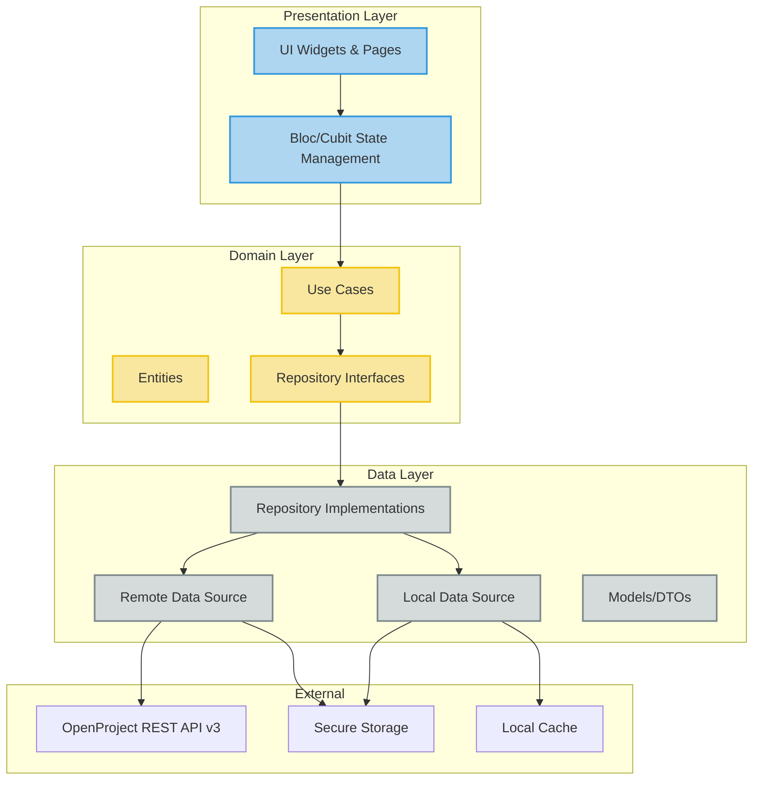
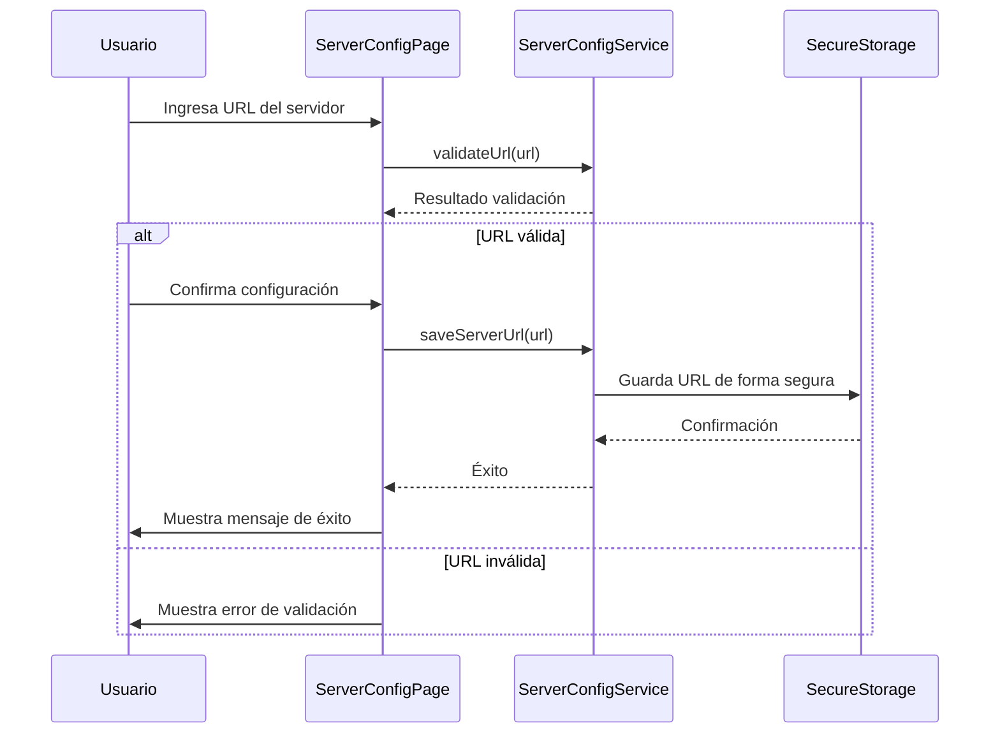
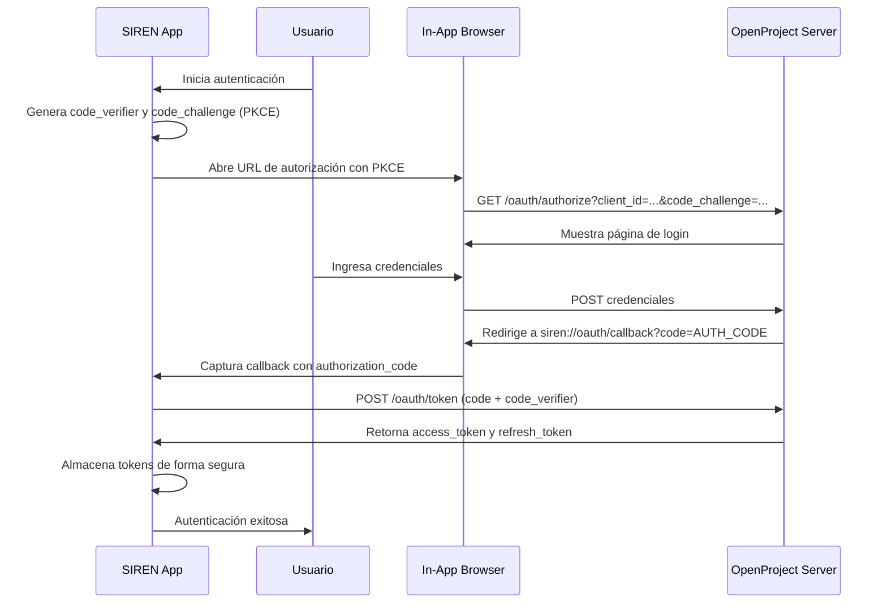
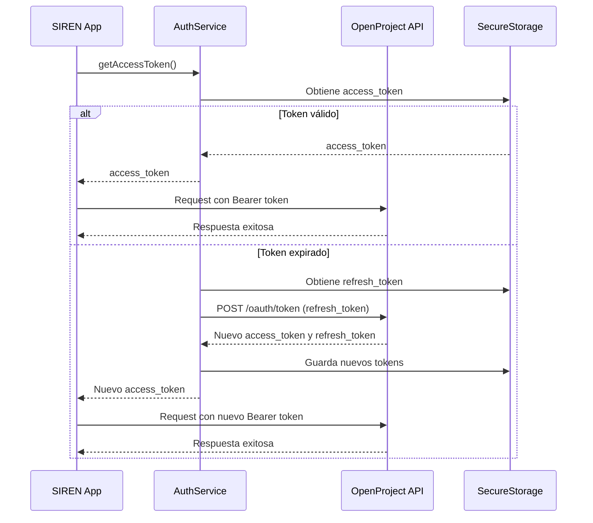
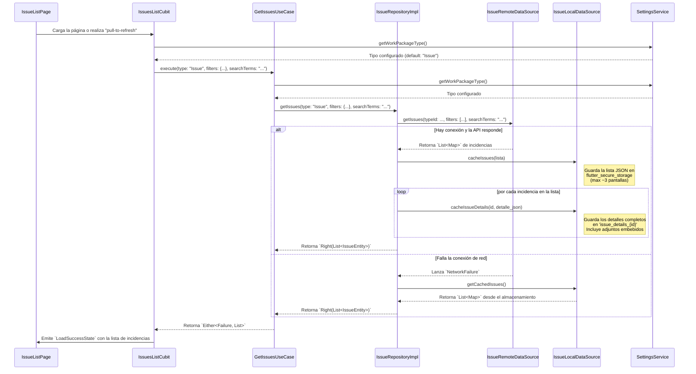
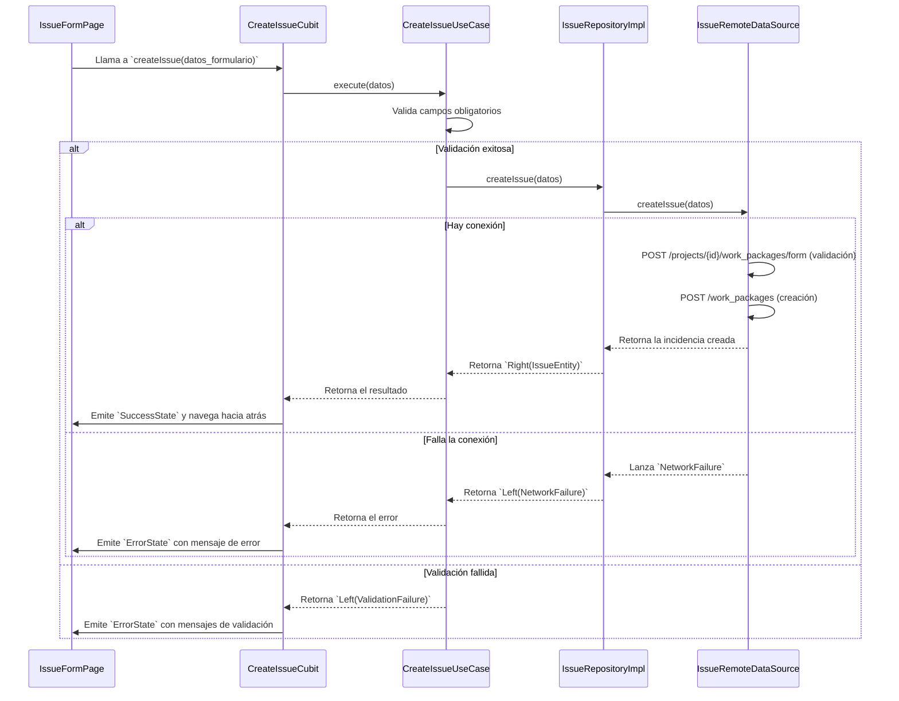
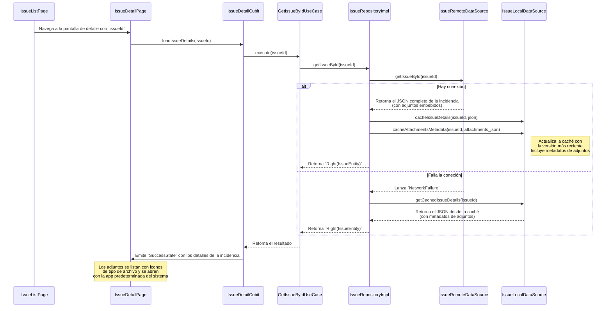
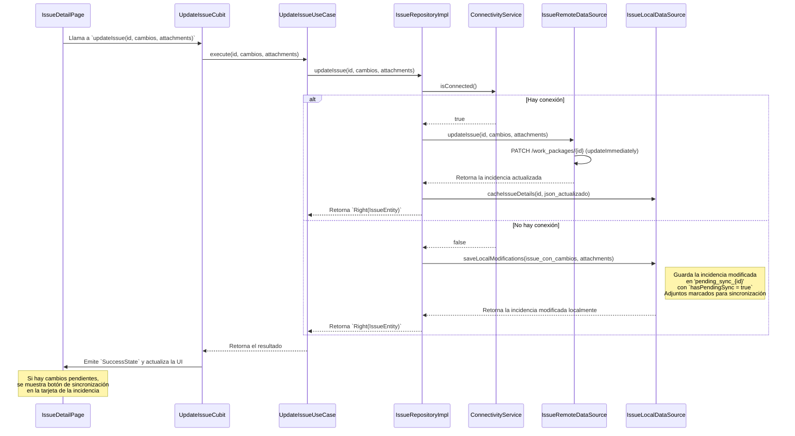
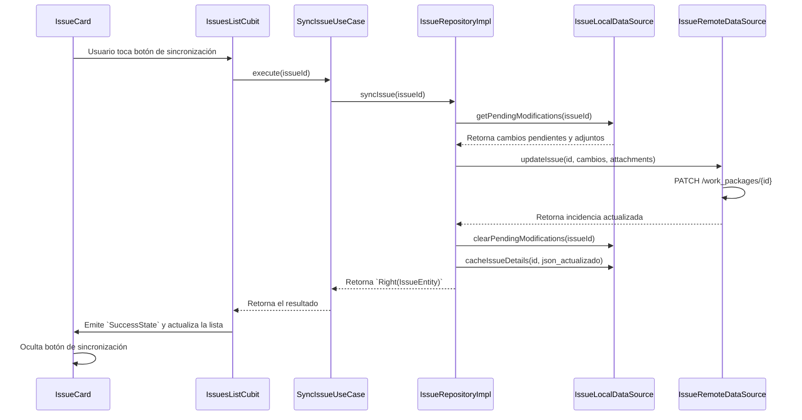

# SIREN: Resumen Completo del Proyecto (Project Overview)

## 1. Introducción

Este documento detalla la arquitectura completa de la aplicación SIREN y sus flujos operativos principales. SIREN (System for Issue Reporting and Engineering Notification) es una aplicación móvil multiplataforma desarrollada con Flutter, diseñada como cliente para una instancia del servidor **OpenProject**.

El objetivo es servir como una guía técnica completa para los desarrolladores, clarificando las bases del proyecto, su implementación actual y el estado de todas las fases desarrolladas.

**Estado del Proyecto:** MVP Completo (Fases 1-5 implementadas)

---

## 2. Arquitectura del Núcleo

La aplicación se fundamenta en una **Arquitectura Limpia (Clean Architecture)** de tres capas, adaptada al ecosistema de Flutter. Este enfoque promueve la separación de responsabilidades, la testeabilidad y la mantenibilidad del código.



### 2.1. Capas de la Arquitectura

#### A. Capa de Presentación (Presentation)
- **Responsabilidad**: Todo lo relacionado con la UI y la gestión del estado.
- **Contenido**:
  - **Widgets (UI)**: Componentes visuales construidos con Flutter y Material Design 3.
  - **State Management (BLoCs/Cubits)**: Orquesta los eventos de la UI, invoca los casos de uso y emite estados para que la UI los renderice. Utilizamos `flutter_bloc` para este propósito.
- **Dependencia**: Depende de la capa de Dominio.

#### B. Capa de Dominio (Domain)
- **Responsabilidad**: Contiene la lógica de negocio central y las reglas de la aplicación. Es el corazón de la aplicación y es totalmente independiente de cualquier framework de UI o de acceso a datos.
- **Contenido**:
  - **Entities**: Objetos de negocio puros (ej. `IssueEntity`, `PriorityLevel`, `IssueStatus`).
  - **Repositories (Abstracciones)**: Interfaces que definen los contratos para la obtención y manipulación de datos (ej. `IssueRepository`).
  - **Use Cases (Casos de Uso)**: Encapsulan una única pieza de lógica de negocio, coordinando el flujo de datos desde los repositorios.
- **Dependencia**: No tiene dependencias de otras capas (Pure Dart).

#### C. Capa de Datos (Data)
- **Responsabilidad**: Implementa los contratos definidos en la capa de Dominio, manejando el origen de los datos (red, base de datos local, etc.).
- **Contenido**:
  - **Repositories (Implementaciones)**: Implementaciones concretas de las interfaces del repositorio de la capa de Dominio.
  - **DataSources**: Clases responsables de comunicarse con una fuente de datos específica:
    - `IssueRemoteDataSource` para la API REST de OpenProject
    - `IssueLocalDataSource` para la caché local (MVP)
  - **DTOs (Data Transfer Objects)**: Modelos que representan la estructura de los datos de la API (ej. `IssueModel`), y que son mapeados a Entidades de Dominio.
- **Dependencia**: Depende de la capa de Dominio.

### 2.2. Tecnologías y Librerías Clave

| Categoría | Tecnología | Propósito |
|-----------|-----------|-----------|
| **Framework** | Flutter 3.0+ / Dart 3.0+ | Framework multiplataforma |
| **Gestión de Estado** | `flutter_bloc` | Manejo de estado reactivo y predecible |
| **Inyección de Dependencias** | `get_it` + `injectable` | Localización de servicios y generación automática del grafo de dependencias |
| **Cliente HTTP** | `dio` | Comunicación de red con interceptores para autenticación y logs |
| **Programación Funcional** | `dartz` | Manejo de errores con `Either<Failure, T>` (Result pattern) |
| **Almacenamiento Seguro** | `flutter_secure_storage` | Almacenamiento seguro de tokens, configuración y caché |
| **Navegador In-App** | `flutter_inappwebview` | Navegador seguro para OAuth2 |
| **Deep Links** | `app_links` | Manejo de callbacks OAuth2 (`siren://oauth/callback`) |
| **Criptografía** | `crypto` | Generación de PKCE (code_verifier, code_challenge) |
| **Testing** | `flutter_test`, `mockito`/`mocktail` | Framework de testing y mocking |

---

## 3. Flujos Operacionales Principales

### 3.1. Configuración Inicial y Autenticación

Los flujos de configuración del servidor y autenticación de usuario (OAuth2 + PKCE) son la base sobre la cual operan todas las demás funcionalidades de la aplicación.

#### 3.1.1. Configuración del Servidor



#### 3.1.2. Autenticación OAuth2 + PKCE



#### 3.1.3. Llamada a API con Refresco Automático de Token



---

## 4. Flujos Detallados de la Feature 'Incidencias'

Esta sección detalla la implementación completa de la funcionalidad principal de la aplicación: la gestión de incidencias.

### 4.1. Listado de Incidencias con Filtrado y Búsqueda

Este flujo describe cómo la aplicación carga la lista de incidencias, aplicando filtros (incluyendo el tipo de Work Package), búsqueda de texto, y garantizando el acceso sin conexión a los datos.

**Detalles Técnicos:**
- **Paginación**: La API de OpenProject se consulta con un tamaño de página por defecto de **50 incidencias** (`pageSize = 50`).
- **Filtro de Tipo**: El `workPackageType` seleccionado en la configuración de la app (default: "Issue") se resuelve a su `ID` correspondiente y se aplica como filtro en la llamada a la API. Este filtro siempre está presente y no puede ser sobrescrito.
- **Filtros Adicionales**: Los usuarios pueden filtrar por:
  - **Estado (Status)**: Múltiple selección de estados dinámicamente cargados
  - **Equipo (Equipment/Project)**: Selección de proyectos específicos
  - **Prioridad (Priority)**: Múltiple selección (Low, Normal, High, Immediate)
  - **Grupo (Group)**: Selección única de grupo
- **Búsqueda de Texto**: Búsqueda case-insensitive en Subject (título) y Description, con coincidencia parcial de palabras. Se combina con otros filtros usando lógica AND.
- **Estrategia "Offline-First"**: El `IssueRepositoryImpl` primero intenta obtener los datos del `IssueRemoteDataSource`. Si falla por un error de red (`NetworkFailure`), automáticamente intenta cargar la lista desde el `IssueLocalDataSource`.
- **Caché Local (MVP)**: Si la llamada a la red es exitosa, la lista de incidencias obtenida se guarda en `flutter_secure_storage` como un JSON bajo la clave `cached_issues`. La caché se limita a aproximadamente **3 pantallas** (150 incidencias) para controlar el uso del almacenamiento.
- **Caché de Detalles y Adjuntos**: Por cada incidencia en la lista obtenida, la aplicación:
  1. Guarda los detalles completos de la incidencia en una clave separada (`issue_details_{id}`).
  2. Guarda metadatos de adjuntos (nombre, tamaño, tipo, URL de descarga) para visualización offline.
  3. Los adjuntos se extraen directamente de la respuesta del work package (`_embedded.attachments._embedded.elements`) para optimizar las llamadas API.



### 4.2. Creación de una Nueva Incidencia

La creación de una nueva incidencia requiere una conexión activa a internet y no se puede realizar en modo offline (MVP).

**Detalles Técnicos:**
- **Validación**: El `CreateIssueUseCase` valida los cuatro campos obligatorios:
  - Subject (título)
  - Priority Level (prioridad)
  - Group (grupo)
  - Equipment (equipo)
- **Flujo de Dos Pasos**: La API de OpenProject utiliza un flujo de dos pasos:
  1. **Validación**: `POST /api/v3/projects/{id}/work_packages/form` - Valida los datos
  2. **Ejecución**: `POST /api/v3/work_packages` - Crea la incidencia con el payload validado
- **Filtrado Dinámico**: El campo Equipment se filtra dinámicamente según el Group seleccionado.
- **Auto-selección**: Si el usuario pertenece a un solo grupo, este se selecciona automáticamente.
- **El `IssueRepositoryImpl` invoca directamente al `IssueRemoteDataSource` para realizar la llamada a la API de creación.



### 4.3. Visualización de Detalles y Adjuntos

Al seleccionar una incidencia, la aplicación intenta obtener la versión más reciente del servidor, pero recurre a la caché si no hay conexión, garantizando el acceso a los datos y adjuntos previamente descargados.

**Detalles Técnicos:**
- **Optimización de API**: Los adjuntos se extraen directamente de la respuesta del work package (`_embedded.attachments._embedded.elements`), reduciendo las llamadas API de 2 a 1.
- **Fallback**: Si los adjuntos embebidos no están disponibles, se utiliza el endpoint separado `GET /api/v3/work_packages/{id}/attachments`.
- **URLs Relativas a Absolutas**: Las URLs relativas de adjuntos se convierten a absolutas para compatibilidad móvil.
- **Visualización Offline**: Los metadatos de adjuntos se muestran desde la caché cuando no hay conexión.



### 4.4. Actualización de una Incidencia (Online/Offline)

La modificación de una incidencia (cambiar estado, descripción, prioridad, etc.) es una operación robusta que funciona tanto online como offline (MVP con sincronización manual).

**Detalles Técnicos:**
- **Modo Online**: Si hay conexión, la app llama directamente a la API para actualizar la incidencia usando `PATCH /api/v3/work_packages/{id}` con el endpoint `updateImmediately`.
- **Modo Offline**: Si no hay conexión, el `IssueRepositoryImpl` guarda una copia de la incidencia con los cambios aplicados en `flutter_secure_storage` bajo una clave especial: `pending_sync_{issueId}`. A la incidencia se le añade una bandera `hasPendingSync: true`.
- **Optimistic Locking**: Se utiliza `lockVersion` para prevenir conflictos de modificación concurrente.
- **Sincronización Manual**: La sincronización de cambios pendientes se realiza manualmente mediante botones de sincronización en las tarjetas de incidencias. Los cambios se sincronizan cuando el usuario toca el botón de sincronización.
- **Cancelación de Cambios**: Los usuarios pueden descartar cambios locales pendientes mediante un botón de cancelación, restaurando la versión original del servidor desde la caché.
- **Adjuntos en Edición**: Los usuarios pueden añadir nuevos adjuntos (fotos/documentos) cuando editan una incidencia. Los adjuntos se suben cuando la incidencia se guarda (online) o se marcan para sincronización (offline).



### 4.5. Sincronización Manual de Cambios Pendientes

Cuando una incidencia tiene modificaciones offline pendientes, el usuario puede sincronizarlas manualmente.



---

## 5. Gestión de Estados y Tipos de Work Package

### 5.1. Selección de Tipo de Work Package

La aplicación permite seleccionar el tipo de Work Package a mostrar (default: "Issue"). Este tipo se almacena de forma segura y se utiliza para filtrar todas las consultas a la API.

**Características:**
- **Almacenamiento Seguro**: El tipo seleccionado se guarda en `flutter_secure_storage`.
- **Resolución Dinámica**: El nombre del tipo se resuelve dinámicamente a su ID correspondiente en OpenProject.
- **Invalidación de Caché**: Cuando el tipo cambia, se invalidan los estados en caché y se recargan los estados disponibles para el nuevo tipo.
- **Filtro Siempre Aplicado**: El filtro de tipo siempre está presente en todas las consultas API y no puede ser sobrescrito por filtros del usuario.

### 5.2. Gestión Dinámica de Estados

Los estados (statuses) se cargan dinámicamente según el tipo de Work Package configurado.

**Características:**
- **Carga por Tipo**: Cada tipo de Work Package puede tener diferentes estados disponibles.
- **Colores desde API**: Los colores de los estados se obtienen desde OpenProject API (`color.hexcode` o `hexCode`).
- **Caché Local**: Los estados se almacenan en caché local para uso offline.
- **Actualización**: Los estados se actualizan cuando:
  - Se cambia el tipo de Work Package
  - Se actualiza la lista de incidencias (pull to refresh)
- **Sin Hardcoding**: No se usan nombres/IDs/colores de estados hardcodeados; todo se carga dinámicamente.

---

## 6. Estado Actual de la Implementación

### 6.1. Fases Completadas (MVP)

#### ✅ Fase 1: Setup / Foundational (7/7 tareas completadas)
- **Fundamento Arquitectónico**: ✅ Sólido y completamente implementado
- **Sistema de Inyección de Dependencias**: ✅ Implementado con `get_it` e `injectable`
- **Manejo de Errores**: ✅ Sistema completo con `Result<Failure, T>`
- **Entidades de Dominio**: ✅ `IssueEntity` con enums de prioridad y estado
- **Interfaces de Repositorio**: ✅ `IssueRepository` definido
- **Data Sources**: ✅ `IssueRemoteDataSource` implementado
- **Autenticación Base**: ✅ Infraestructura preparada

#### ✅ Fase 2: Configuration and Testing Infrastructure (13/13 tareas completadas)
- **Configuración del Servidor**: ✅ Funcional con validación de URL
- **Autenticación (OAuth2+PKCE)**: ✅ Funcional con flujo completo
- **Almacenamiento Seguro de Tokens**: ✅ Funcional con `flutter_secure_storage`
- **Refresco Automático de Tokens**: ✅ Funcional
- **Pantalla de Configuración Inicial**: ✅ Implementada
- **Pantalla de Configuración (Settings)**: ✅ Implementada con logout
- **Lógica de Inicialización**: ✅ Implementada
- **Infraestructura de Testing**: ✅ Configurada con mocks y fixtures

#### ✅ Fase 3: Quick Issue Registration (9/9 tareas completadas)
- **IssueModel (DTO)**: ✅ Implementado con mapeo HATEOAS
- **createIssue en RemoteDataSource**: ✅ Implementado con flujo de dos pasos
- **CreateIssueUseCase**: ✅ Implementado con validación
- **IssueFormPage UI**: ✅ Implementada con Material Design 3
- **Gestión de Estado (Bloc/Cubit)**: ✅ Implementada
- **Validación y Manejo de Errores**: ✅ Implementado
- **Filtrado Dinámico**: ✅ Group y Equipment filtrados dinámicamente
- **Auto-selección de Grupo**: ✅ Implementada
- **Navegación y FAB**: ✅ Implementada

#### ✅ Fase 4: Issue Lifecycle Management (22/24 tareas completadas, 2 Post-MVP)
- **Listado de Incidencias**: ✅ Implementado con filtrado por tipo
- **IssueListPage UI**: ✅ Implementada con Material Design 3
- **IssueCard Widget**: ✅ Implementado con indicadores visuales
- **IssueDetailPage UI**: ✅ Implementada (modo lectura y edición)
- **Edición de Incidencias**: ✅ Implementada con validación
- **Actualización de Incidencias**: ✅ Implementada (online/offline)
- **Soporte de Adjuntos**: ✅ Implementado (añadir, visualizar)
- **Caché Offline (MVP)**: ✅ Implementada para lista, detalles y adjuntos
- **Sincronización Manual**: ✅ Implementada con botones de sync/cancel
- **Gestión Dinámica de Estados**: ✅ Implementada basada en tipo de Work Package
- **Selección de Tipo de Work Package**: ✅ Implementada en Settings
- **Optimización de Adjuntos**: ✅ Adjuntos embebidos reducen llamadas API

#### ✅ Fase 5: Issue Search and Filtering (5/5 tareas completadas)
- **Filtrado Multi-criterio**: ✅ Implementado (Status, Equipment, Priority, Group)
- **Búsqueda de Texto**: ✅ Implementada en Subject y Description
- **Lógica AND**: ✅ Todos los filtros combinados con AND
- **Filtro de Tipo Siempre Aplicado**: ✅ Implementado y no sobrescribible
- **UI de Filtrado**: ✅ Implementada con modal/sheet
- **Búsqueda en Tiempo Real**: ✅ Implementada con debouncing

### 6.2. Características Implementadas

#### Gestión de Incidencias
- ✅ **Listado de incidencias** con estrategia "offline-first"
- ✅ **Caché local** de lista, detalles y metadatos de adjuntos (MVP)
- ✅ **Creación de incidencias** (solo online, MVP)
- ✅ **Actualización de incidencias** (con capacidad offline y sincronización manual)
- ✅ **Visualización de detalles y adjuntos** (online/offline)
- ✅ **Filtrado avanzado** por múltiples criterios
- ✅ **Búsqueda de texto** en títulos y descripciones
- ✅ **Gestión dinámica de estados** basada en tipo de Work Package

#### Autenticación y Configuración
- ✅ **OAuth2 + PKCE** para autenticación segura
- ✅ **Configuración de servidor** con validación
- ✅ **Almacenamiento seguro** de tokens y configuración
- ✅ **Refresco automático** de tokens
- ✅ **Logout** con preservación de configuración

#### UI/UX
- ✅ **Material Design 3** en todas las pantallas
- ✅ **Esquema de colores** suave (azules y púrpuras)
- ✅ **Diseño responsive** para smartphones
- ✅ **Indicadores visuales** de prioridad y estado
- ✅ **Feedback claro** para acciones del usuario

### 6.3. Características Pendientes (Post-MVP)

#### Fase 6: Architectural Preparation (Post-MVP)
- ⏳ Implementación completa de i18n (estructura preparada)
- ⏳ Diseño de arquitectura offline-first completa
- ⏳ Preparación para integración de AI
- ⏳ Arquitectura de comandos de voz

#### Fase 7: Offline Issue Management (Post-MVP)
- ⏳ Base de datos local completa (Isar/Hive)
- ⏳ Sincronización automática
- ⏳ Resolución de conflictos
- ⏳ Almacenamiento local de adjuntos grandes
- ⏳ Modo offline completo para creación de incidencias

---

## 7. Estructura del Proyecto

```
/lib
├── /core                    # Infraestructura core
│   ├── /auth               # Autenticación OAuth2 + PKCE
│   │   ├── auth_service.dart
│   │   └── auth_interceptor.dart
│   ├── /config             # Configuración
│   │   └── server_config_service.dart
│   ├── /di                 # Inyección de dependencias
│   │   ├── di_container.dart
│   │   ├── injection.dart
│   │   └── /modules        # Módulos de inyección
│   ├── /error              # Manejo de errores
│   │   └── failures.dart
│   ├── /i18n               # Internacionalización (preparado)
│   │   ├── /l10n
│   │   ├── localization_service.dart
│   │   └── localization_repository.dart
│   ├── /network            # Configuración de red
│   │   └── dio_client.dart
│   └── /theme              # Temas de la aplicación
│       └── app_colors.dart
│
├── /features                # Módulos de características
│   ├── /config             # Feature de configuración
│   │   └── /presentation
│   │       ├── /pages
│   │       │   ├── app_initialization_page.dart
│   │       │   ├── server_config_page.dart
│   │       │   └── settings_page.dart
│   │       └── /cubit
│   │           └── localization_cubit.dart
│   │
│   └── /issues             # Feature principal: Gestión de incidencias
│       ├── /data           # Capa de datos
│       │   ├── /datasources
│       │   │   ├── issue_remote_datasource.dart
│       │   │   └── issue_remote_datasource_impl.dart
│       │   ├── /models
│       │   │   └── issue_model.dart
│       │   └── /repositories
│       │       └── issue_repository_impl.dart
│       │
│       ├── /domain         # Capa de dominio (Pure Dart)
│       │   ├── /entities
│       │   │   └── issue_entity.dart
│       │   ├── /repositories
│       │   │   └── issue_repository.dart
│       │   └── /usecases
│       │       ├── create_issue_uc.dart
│       │       ├── get_issues_uc.dart
│       │       ├── get_issue_by_id_uc.dart
│       │       └── update_issue_uc.dart
│       │
│       └── /presentation   # Capa de presentación
│           ├── /pages
│           │   ├── issue_list_page.dart
│           │   ├── issue_detail_page.dart
│           │   └── issue_form_page.dart
│           ├── /widgets
│           │   ├── issue_card.dart
│           │   ├── issue_filter_sheet.dart
│           │   └── attachment_list_item.dart
│           └── /cubit
│               ├── issues_list_cubit.dart
│               ├── issue_detail_cubit.dart
│               └── create_issue_cubit.dart
│
└── main.dart                # Punto de entrada de la aplicación

/test                        # Tests
├── /core
│   ├── /mocks              # Implementaciones mock
│   └── /fixtures           # Datos de prueba
└── /features
    └── /issues              # Tests por capa
        ├── /domain
        ├── /data
        └── /presentation
```

---

## 8. Patrones y Principios de Diseño

### 8.1. Clean Architecture
- **Separación estricta de capas**: Cada capa tiene responsabilidades claras
- **Dependencia unidireccional**: Las capas internas no dependen de las externas
- **Domain puro**: La capa de dominio es independiente de frameworks

### 8.2. Result Pattern
- **Manejo funcional de errores**: Uso de `Result<Failure, T>` (equivalente a `Either<Failure, T>`)
- **Sin excepciones en casos de uso**: Los casos de uso nunca lanzan excepciones
- **Tipos de fallo específicos**: `ServerFailure`, `NetworkFailure`, `ValidationFailure`, etc.

### 8.3. Dependency Injection
- **Inyección por constructor**: Todas las dependencias se inyectan por constructor
- **Generación automática**: Uso de `injectable` para generar código de registro
- **Módulos modulares**: Dependencias organizadas en módulos por feature

### 8.4. State Management
- **Bloc/Cubit pattern**: Gestión de estado reactiva y predecible
- **Estados inmutables**: Uso de `Equatable` para comparación de estados
- **Separación de lógica**: La lógica de negocio está en los casos de uso, no en los Cubits

---

## 9. Integración con OpenProject API v3

### 9.1. Endpoints Principales

| Método | Endpoint | Propósito |
|--------|----------|-----------|
| `GET` | `/api/v3/work_packages` | Listar incidencias con filtros |
| `GET` | `/api/v3/work_packages/{id}` | Obtener detalles de una incidencia |
| `POST` | `/api/v3/work_packages` | Crear nueva incidencia |
| `PATCH` | `/api/v3/work_packages/{id}` | Actualizar incidencia |
| `POST` | `/api/v3/work_packages/{id}/attachments` | Añadir adjuntos |
| `GET` | `/api/v3/statuses` | Obtener estados disponibles |
| `GET` | `/api/v3/priorities` | Obtener prioridades disponibles |
| `GET` | `/api/v3/projects` | Obtener proyectos (equipos) |
| `GET` | `/api/v3/groups` | Obtener grupos del usuario |
| `GET` | `/api/v3/types` | Obtener tipos de Work Package |

### 9.2. Principios HATEOAS
- **Descubrimiento de recursos**: Uso de `_links` para navegar entre recursos
- **URLs relativas**: Las URLs en `_links` son relativas y se convierten a absolutas
- **Sin hardcoding**: No se construyen URLs manualmente, se usan los `_links` proporcionados

### 9.3. Autenticación
- **OAuth2 + PKCE**: Flujo de autorización con Proof Key for Code Exchange
- **Bearer Token**: Tokens de acceso enviados en header `Authorization: Bearer {token}`
- **Refresco automático**: Renovación automática de tokens expirados

---

## 10. Referencias y Documentación

### 10.1. Documentación de Fases
- **Fase 1**: `docs/PHASE1_SETUP_DEVELOPMENT_SIREN_APP.md` - Setup y fundamentos
- **Fase 2**: `docs/PHASE2_CONFIGURATION_TESTING_SIREN_APP.md` - Configuración y testing
- **Fase 3**: `docs/PHASE3_QUICK_ISSUE_REGISTRATION_SIREN_APP.md` - Registro rápido de incidencias
- **Fase 4**: `docs/PHASE4_ISSUE_LIFECYCLE_MANAGEMENT_SIREN_APP.md` - Gestión del ciclo de vida
- **Fase 5**: `docs/PHASE5_ISSUE_SEARCH_FILTERING_SIREN_APP.md` - Búsqueda y filtrado

### 10.2. Documentación Técnica
- **Especificación**: `context/SDD/PHASE1_SPEC_SIREN.md`
- **Plan Técnico**: `context/SDD/PHASE2_PLAN_SIREN.md`
- **Lista de Tareas**: `context/SDD/PHASE3_TASKS_SIREN.md`
- **API de OpenProject**: `context/OPENPROJECT_API_V3.md`
- **Guías de Agentes**: `AGENTS.md`

### 10.3. Workflows de Implementación
- **OAuth2**: `context/WORKFLOW_STORY2_OAUTH2_OPENPROJECT_SIREN.md`
- **Registro Rápido**: `context/WORKFLOW_STORY3_QUICK_ISSUE_REGISTRATION.md`
- **Listado**: `context/WORKFLOW_STORY4_ISSUE_LISTING.md`
- **Detalles**: `context/WORKFLOW_STORY4_ISSUE_DETAILS.md`
- **Edición**: `context/WORKFLOW_STORY4_ISSUE_EDIT.md`
- **Adjuntos**: `context/WORKFLOW_STORY4_ATTACHMENTS.md`
- **Filtrado**: `context/WORKFLOW_STORY5_ISSUE_FILTERING.md`

---

## 11. Métricas y Calidad de Código

### 11.1. Cobertura de Tests
- **Capa de Dominio**: ≥ 90%
- **Capa de Datos**: ≥ 85%
- **Capa de Presentación**: ≥ 80%

### 11.2. Análisis Estático
- **Estado**: ✅ Pasando
- **Última Verificación**: `flutter analyze` - Sin errores
- **Estándares**: Sigue Effective Dart style guide

### 11.3. Estándares de Código
- **Longitud máxima de línea**: 80 caracteres
- **Comentarios**: Todos en inglés
- **Nombres significativos**: Variables y funciones con nombres descriptivos
- **Preferencia por `final`**: Uso de `final` sobre `var`
- **Constructores `const`**: Cuando es aplicable

---

## 12. Próximos Pasos

### 12.1. Post-MVP (Fase 6-7)
- **Implementación completa de i18n**: Español/Inglés
- **Base de datos local**: Integración de Isar/Hive
- **Sincronización automática**: Mecanismo completo de sincronización
- **Resolución de conflictos**: UI y lógica para manejar conflictos
- **Comandos de voz**: Arquitectura y implementación

### 12.2. Mejoras Futuras
- **Integración de AI**: Categorización automática y sugerencias
- **Analíticas**: Seguimiento y reportes de incidencias
- **Notificaciones push**: Alertas en tiempo real
- **Modo oscuro**: Soporte completo de temas

---

**Document Version:** 2.0  
**Last Updated:** 2025-01-XX  
**Maintained By:** Development Team  
**Review Frequency:** After each major phase completion
